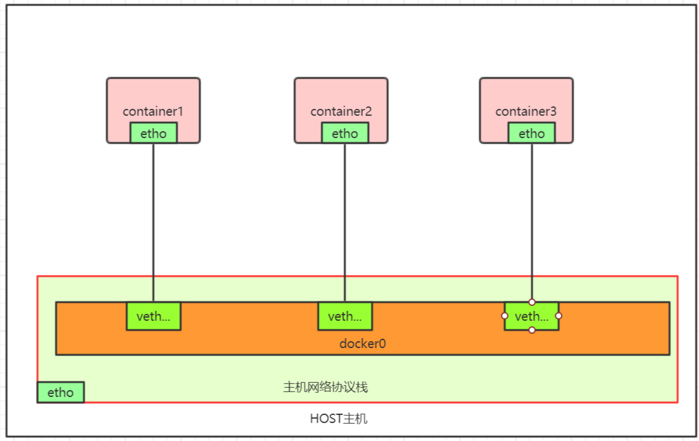

# 单主机容器网络

容器是通过namespace进行隔离，每个容器都有自己的namespace，而每个隔离的namespace一般都有自己的网络协议栈。那么，在同一个主机上，不同network namespace的两个容器之间怎么进行通信呢？

一个容器可以看成是一台主机，两台主机之间的通信可以用一根网线连起来；多台主机之间通信可以把它们都连接在一个交换机上。

在Linux上，起到虚拟交换机作用的就是网桥。安装docker时，docker会默认在宿主机上装一个docker0网桥，宿主机上的容器，通过Veth Pair（好比是网线）连到docker0网桥上。Veth Pair是一个虚拟设备，其特点是：它创建出来后，总是以两张虚拟网卡的形式成对出现，其中一个网卡发送的数据包，可以直接出现在与它对应的另外一张网卡上，即使两个网卡不在同一个namespace。

结论：在默认情况下，被限制在Network Namespace里的容器进程，实际上是通过Veth Pair设备对+宿主机docker0网桥的方式，实现了同其他容器的数据交换。

访问说明；

> 1. 从宿主机访问容器时，请求的数据包，先通过宿主机上的路由规则到达docker0网桥，然后，通过docker0网桥转发到对应的Veth Pair设备对，然后，通过veth pair设备对到达容器内部。
> 2. 从当前容器访问其他容器，请求的数据包通过Veth Pair设备对到达docker0网桥，通过docker0网桥再进入对应的Veth Pair设备对，到达目的容器。
> 3. 从当前容器访问主机或者其他主机，请求的数据包通过Veth Pari设备对到达docker0网桥，从docker0网桥再进入主机协议栈。

## 参考

1. [Docker单机网络模型动手实验](https://mz1999.github.io/blog/docs/docker-network-bridge.html)

