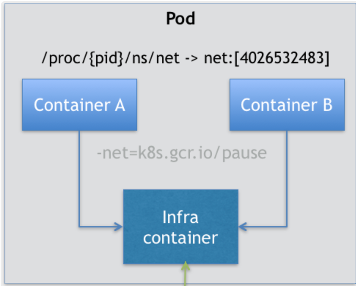

## pod的yaml文件定义

```yaml
apiVersion: v1
kind: Pod
metadata:
  name: two-containers
spec:
  restartPolicy: Never
  volumes:
  - name: shared-data
    hostPath:      
      path: /data
  containers:
  - name: nginx-container
    image: nginx
    volumeMounts:
    - name: shared-data
      mountPath: /usr/share/nginx/html
  - name: debian-container
    image: debian
    volumeMounts:
    - name: shared-data
      mountPath: /pod-data
    command: ["/bin/sh"]
    args: ["-c", "echo Hello from the debian container > /pod-data/index.html"]

```

pod中的几个重要字段：除了传统的apiVersion、kind、metadta、spec、status外

- `.spec.hostAliases`：定义pod中hosts（/etc/hosts）内容

  ```markdown
  apiVersion: v1
  kind: Pod
  ...
  spec:
    hostAliases:
    - ip: "10.1.2.3"
      hostnames:
      - "foo.remote"
      - "bar.remote"
  ...
  ```

- `.spec.containers.lifecycle`：定义容器生命周期钩子，在容器生命周期中，当容器的状态发生改变时，将触发一系列钩子。

  ```markdown
  apiVersion: v1
  kind: Pod
  metadata:
    name: lifecycle-demo
  spec:
    containers:
    - name: lifecycle-demo-container
      image: nginx
      lifecycle:
        postStart:
          exec:
            command: ["/bin/sh", "-c", "echo Hello from the postStart handler > /usr/share/message"]
        preStop:
          exec:
            command: ["/usr/sbin/nginx","-s","quit"]
  
  ```

  > - postStart：定义容器启动后立即执行的动作。不过注意，这个动作和容器的ENTRYPOINT并不是同步的，换句话说，它不保证顺序，postStart启动时，ENTRYPOINT可能还没有结束。
  > - preStop：定义容器杀死前执行的动作。preStop和杀死容器是同步阻塞的，也就是说，preStop没有执行完成，那么杀死容器就不能执行。

## pod的原理

- <font color=red>pod的一个重要事实：它只是一个逻辑概念。</font>

  > kubernetes真正处理的，还是宿主机上的Linux容器的namespace和cgroups。并不存在所谓的pod边界或者隔离环境。pod实际上是一组共享了资源的容器。具体的说，pod中的所有容器共享了同一个Network Namespace和相同的volume。

- <font color=red>既然是共享Network Space和volume，那么是A共享B、还是B共享A，还是其他方式呢？</font>

  > 假如，有包含A和B两个容器的pod，如果容器A共享容器B的资源，那么：
  >
  > ```markdown
  > docker run --net=B --volumes-from=B --name=A image-A
  > ```
  >
  > 如果真是这样的话，需要容器B在容器A之前启动，A和B就不是对等关系，而变成拓扑关系了。所以，pod的实现需要一个中间容器。

- <font color=red>实现pod的中间容器：</font>

  > 实现pod的中间容器，也叫Infra容器（镜像是`k8s.gcr.io/pause`，镜像很小，容器处于暂停状态）。一个pod中Infra容器是第一个被启动的容器。用户定义的容器，通过Join Network Namespace，与Infra容器关联在一起。
  >
  > 
  >
  > 
  >
  > 也就是说，对容器A和B来说：
  >
  > - 可以直接使用localhost通信，因为他们都共享的是Infra的网络命名空间
  > - 一个Pod对应一个IP地址，也就是Pod的Network Namespace对应的IP地址。
  > - Pod的生命周期只和Infra容器一致，与容器A和B无关。

## pod资源对象

pod资源对象用于运行单个容器化的应用，此应用称为pod对象的主容器，当然，pod也能同时容纳多个容器，额外的容器一般的工作模型有一下几种：

### Sidecar模型

这个模型是为pod中的主容器提供协同的辅助应用容器。例如：主应用容器中的日志使用agent收集到日志服务器中，agent作为辅助应用容器。

### Ambassador模型

这个模型是为远程服务在pod中创建一个本地代理，pod中的主容器通过代理容器访问远程服务。例如：主应用容器访问远程一主多从模型的远程Redis应用时，可以在当前容器中为远程Redis创建一个本地代理Ambassador container，主应用容器直接通过localhost接口访问Ambassador接口即可，这样，Redis有修改的话，不用修改主容器，只需要修改这个代理容器即可。

### Adapter模型

一般用于不兼容时做适配，如：容器日志格式化输出。

## pod的生命周期

### 几个状态

pod在生命周期中有一下几个状态：

| 状态      | 说明                                                         |
| --------- | ------------------------------------------------------------ |
| pending   | API Server创建pod资源对象已经存入etcd，尚未调度完成或正在下载镜像 |
| Running   | pod已被调度，所有容器都已被kubelet创建完成                   |
| Successed | pod中所有容器都已经终止并不会重启                            |
| Failed    | 所有容器都已终止，且至少一个非正常终止（返回非0值）          |
| Unknown   | APIServer无法获取pod的状态信息，通常是无法和工作节点上的kubelet通信所致 |

### pod创建过程

1. 客户端（kubectl等）提交pod spec给APIServer。
2. APIServer尝试将pod对象的相关信息写入etcd，写入操作完成，APIServer会返回信息给客户端。
3. APIServer将会一直反映etcd中的状态变化
   1. kubernetes所有组件均使用“watch”机制跟踪检查APIServer上的相关变动。
   2. kube-scheduler的“watcher”察觉到APIServer创建了一个新的pod，还没有绑定到任何节点，然后，它就为pod挑选了一个工作节点并将信息更新至APIServer。
   3. APIServer将调度结果更新至etcd，同时，它会反映出pod对象的调度结果。
   4. pod所在节点上的kubelet尝试在当前节点调用docker启动容器，并将容器的启动状态返回给APIServer。
   5. APIServer将pod状态信息存入etcd系统中，将存储结果发送到相关的kubelet。

## Projected Volume

<font color=red>Projected Volume</font>

> 为容器提供预先定义好的数据。（不是存放容器里的数据，也不是进行容器和宿主机之间的数据交换）、

<font color=red>Projected Volume支持的四种类型：</font>

> - Secret
> - ConfigMap
> - Downward API
> - ServiceAccountToken

### <font color=red>Secret</font>

一般保存的是密码信息

```yaml
apiVersion: v1
kind: Pod
metadata:
  name: test-projected-volume 
spec:
  containers:
  - name: test-secret-volume
    image: busybox
    args:
    - sleep
    - "86400"
    volumeMounts:
    - name: mysql-cred
      mountPath: "/projected-volume"
      readOnly: true
  volumes:
  - name: mysql-cred
    projected:
      sources:
      - secret:
          name: user
      - secret:
          name: pass

```

```markdown
cat ./username.txt
admin
$ cat ./password.txt
c1oudc0w!

$ kubectl create secret generic user --from-file=./username.txt
$ kubectl create secret generic pass --from-file=./password.txt
```

### <font color=red>ConfigMap</font>

一般保存的是应用的配置信息，用法和secret类似。

```yaml
# .properties 文件的内容
$ cat example/ui.properties
color.good=purple
color.bad=yellow
allow.textmode=true
how.nice.to.look=fairlyNice

# 从.properties 文件创建 ConfigMap
$ kubectl create configmap ui-config --from-file=example/ui.properties

# 查看这个 ConfigMap 里保存的信息 (data)
$ kubectl get configmaps ui-config -o yaml
apiVersion: v1
data:
  ui.properties: |
    color.good=purple
    color.bad=yellow
    allow.textmode=true
    how.nice.to.look=fairlyNice
kind: ConfigMap
metadata:
  name: ui-config
  ...
```

### <font color=red>Downward API</font>

作用：让pod里的容器可以直接获取到这个Pod API对象本身的信息

```yaml
apiVersion: v1
kind: Pod
metadata:
  name: test-downwardapi-volume
  labels:
    zone: us-est-coast
    cluster: test-cluster1
    rack: rack-22
spec:
  containers:
    - name: client-container
      image: k8s.gcr.io/busybox
      command: ["sh", "-c"]
      args:
      - while true; do
          if [[ -e /etc/podinfo/labels ]]; then
            echo -en '\n\n'; cat /etc/podinfo/labels; fi;
          sleep 5;
        done;
      volumeMounts:
        - name: podinfo
          mountPath: /etc/podinfo
          readOnly: false
  volumes:
    - name: podinfo
      projected:
        sources:
        - downwardAPI:
            items:
              - path: "labels"
                fieldRef:
                  fieldPath: metadata.labels
```

暴露了Pod的metadata.labels信息给容器

```yaml
kubectl create -f dapi-volume.yaml
$ kubectl logs test-downwardapi-volume
cluster="test-cluster1"
rack="rack-22"
zone="us-est-coast"
```

> 注意：
>
> 1. Downward API能够获取到的信息，一定是Pod里的容器进程启动之前能够确定下来的信息。

### <font color=red>Service Account</font>

​	解决服务访问Kubernetes时，APIServer对服务的授权。Service Account是一种特殊的Secret，叫做ServiceAccountToken。它里面保存的是APIServer的授权信息，也就是token，有这个token，才可以合法方二万APIServer。

​	在每个pod中，有一个名为：default-token-xxx的volume，自动挂载在每个容器的一个固定目录上。

```yaml
$ kubectl describe pod test-projected-volume 
Volumes:
  mysql-cred:
    Type:                Projected (a volume that contains injected data from multiple sources)
    SecretName:          user
    SecretOptionalName:  <nil>
    SecretName:          pass
    SecretOptionalName:  <nil>
  default-token-hmh97:
    Type:        Secret (a volume populated by a Secret)
    SecretName:  default-token-hmh97
    Optional:    false
...
	Mounts:
      /projected-volume from mysql-cred (ro)
      /var/run/secrets/kubernetes.io/serviceaccount from default-token-hmh97 (ro)
...
```

然后，容器就可以从`/var/run/secrets/kubernetes.io/serviceaccount`读取授权信息

```markdown
ls /var/run/secrets/kubernetes.io/serviceaccount 
ca.crt namespace  token
```

## PodPreset(Pod预设置)

为pod默认填充内容

```yaml
apiVersion: settings.k8s.io/v1alpha1
kind: PodPreset
metadata:
  name: allow-database
spec:
  selector:
    matchLabels:
      role: frontend
  env:
    - name: DB_PORT
      value: "6379"
  volumeMounts:
    - mountPath: /cache
      name: cache-volume
  volumes:
    - name: cache-volume
      emptyDir: {}

```

> 说明：
>
> - PodPreset 里定义的内容，只会在Pod对象创建之前追加在这个对象本身上，不会影响任何Pod的控制器的定义。
> - 同一个pod的多个PodPreset会合并，冲突字段不会修改。