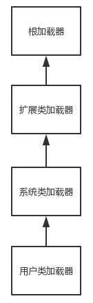

# 反射

程序使用某个类，如果类还没有被加载到内存中，系统会通过<font color=red>加载，连接，初始化</font>三个步骤对类进行初始化。

## 类的加载、连接、初始化

### 类的加载

> 指将类的class文件读入内存，并为之创建一个`java.lang.Class`对象。

类的加载由类加载器完成，类加载器由JVM提供（系统加载器），当然，你可以继承`ClassLoader`基类创建自己的类加载器。不同的类加载器，可以从不同来源加载类的class二进制数据：

> - 本地文件系统加载class文件
> - 从jar包加载class文件，如加载mysql驱动
> - 从网络加载class文件
> - java源文件动态编译，执行加载

类加载器可以预先加载类，无需等到首次使用时加载。

### 类的连接

类被加载后，系统为之生成Class对象，接着进入连接阶段，连接阶段负责把类的二进制数据合并到JRE中，分为三个阶段：

> - 验证：验证加载的类是否有正确的内部结构
> - 准备：为类的变量分配内存，设置初始值
> - 解析：将类二进制数据中的符号引用替换为直接引用

### 类的初始化

虚拟机负责对类进行初始化，主要对类变量进行初始化，java类中变量初始化有两种方式：

> - 声明类的变量时指定初始值
> - 使用静态初始化块为类变量指定初始值。

JVM初始化一个类包含如下步骤：

> - 如果当前类没有被加载和连接，程序先加载和连接该类。
>
> - 如果该类的直接父类没有被初始化，先初始化其直接父类。
>
> - 如果类中有初始化语句，系统执行这些初始化语句。
>
>   执行第二步时，重复123步，所以，JVM最先初始化的是`java.lang.Object`类。  

## 类加载器

类加载器负责加载所有的类，一旦一个类被载入JVM中，同一个类不会再此载入了，什么是同一个类？

> - Java中：类使用全限定类名作为标识
> - JVM中：类使用权限定类名和类加载器作为唯一标识

JVM启动时，形成三个类加载器组成的初始类加载层次结构：

> - Bootstrap ClassLoader：根类加载器。加载Java核心类，它很特殊，不是`java.lang.ClassLoader`的子类，甚至不是java语言实现的，它是JVM自身实现的。
> - Extension ClassLoader：扩展类加载器，加载JRE的扩展目录（`%JAVA_HOME%/jre/lib/ext或者java.ext.dirs系统属性指定的目录`）中JAR包的类。
> - System ClassLoader：系统类加载器。负责JVM启动时加载来自java命令的-classpath选项、java.class.path系统属性、CLASSPATH环境变量所指的JAR包和类路径。

### 类的加载机制

> - 全盘负责：类加载器负责加载该类及该类所依赖、引用的其他类
> - 父类委托：先让父（parent）加载器加载，父加载器加载不到，再从自己类路径下加载。
> - 缓存机制：所有被加载过的类都会被缓存，加载类时，先从缓存加载，缓存区不存在该类对象，系统才会读取该类对应的二进制数据，将其转换成Class对象，存入缓存区中。



类加载器之间的父子关系不是类继承上的父子关系，这一点要明确注意。

```java
public class ClassLoaderTest {
    public static void main(String[] args) throws IOException {
        ClassLoader systemClassLoader = ClassLoader.getSystemClassLoader();
        System.out.println("系统类加载器：" + systemClassLoader);
        //获取系统加载器的路径
        Enumeration<URL> resources = systemClassLoader.getResources("");
        while (resources.hasMoreElements()) {
            System.out.println(resources.nextElement());
        }

        //获取当前类加载器的父加载器
        ClassLoader parent = systemClassLoader.getParent();
        System.out.println("扩展加载器：" + parent);
        System.out.println("扩展加载器的类路径：" + System.getProperty("java.ext.dirs"));
        System.out.println("扩展类加载器的父加载器：" + parent.getParent());
    }
}
```

结果：

```java
系统类加载器：sun.misc.Launcher$AppClassLoader@18b4aac2
file:/D:/Share/javabase/%e5%8f%8d%e5%b0%84/out/production/%e5%8f%8d%e5%b0%84/
扩展加载器：sun.misc.Launcher$ExtClassLoader@1b6d3586
扩展加载器的类路径：D:\Windows\jdk8\jdk1.8.0_211\jre\lib\ext;C:\Windows\Sun\Java\lib\ext
扩展类加载器的父加载器：null
```

