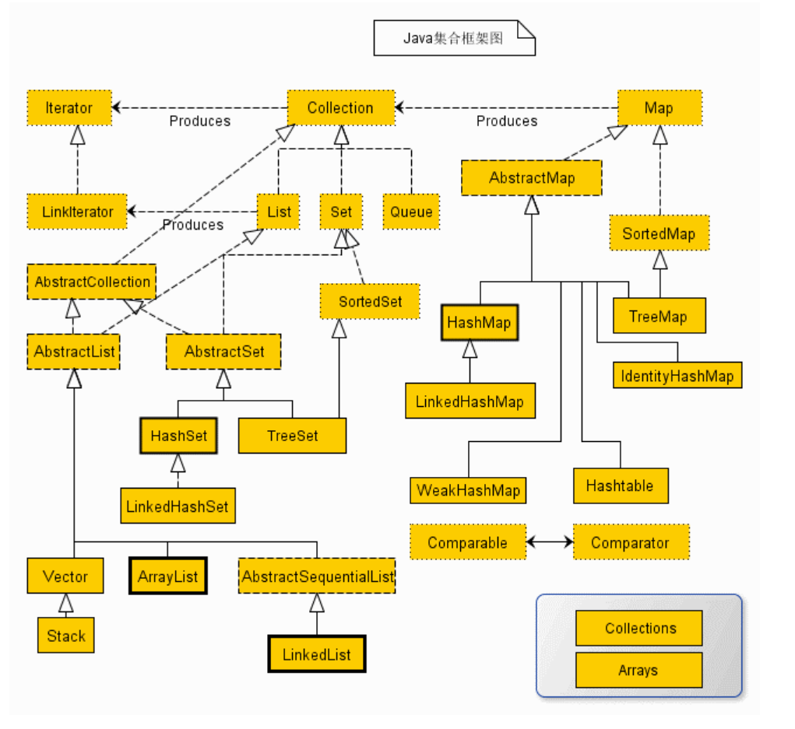

# ArrayList源码解析



## 概要

> 1. `ArrayList`是底层是一个数组，不过这个数组可以扩容，线程不安全，允许元素为`null`
> 2. `ArrayList`继承了`AbstractList`抽象类，实现了`List、RandomAccess、Clonable、Serializable`接口
> 3. 由于底层是一个数组，所以插入元素、访问元素快，时间复杂度O(1)；删除元素慢，时间复杂度O(n)

## 成员变量

```java
public class ArrayList<E> extends AbstractList<E>
        implements List<E>, RandomAccess, Cloneable, java.io.Serializable
{
    private static final long serialVersionUID = 8683452581122892189L;

    /**
     * 默认初始化容量10
     */
    private static final int DEFAULT_CAPACITY = 10;

    /**
     * 可共享的空数组实例
     */
    private static final Object[] EMPTY_ELEMENTDATA = {};

    /**
     * 可共享的具有默认大小的空实例
     * 和上面的EMPTY_ELEMENTDATA的区别：上面的就是单纯的空实例，这个是标识ArrayList有默认大小的
     * 只不过里面还没放元素，所以，初始时是空数组，后面再进行延迟实例化，提高性能
     */
    private static final Object[] DEFAULTCAPACITY_EMPTY_ELEMENTDATA = {};

    /**
     * ArrayList中的元素存放的位置，ArrayList的容量就是这个数组的大小
     * 若谷elementData == DEFAULTCAPACITY_EMPTY_ELEMENTDATA，那么，第一次添加元素的
     * 时候，数组会被初始化为默认的容量，也就是10
     */
    transient Object[] elementData; // non-private to simplify nested class access

    /**
     * ArrayList中包含的元素的个数（它不是数组的大小哦）
     */
    private int size;

```

## 构造函数（初始化）

> 构造函数有三个：
>
> 1. 默认构造函数，数组大小就是默认的10
> 2. 使用指定的初始化容量进行初始化
> 3. 使用制定的集合进行初始化

```java
/**
* 使用指定的initialCapacity进行初始化
*/
public ArrayList(int initialCapacity) {
    if (initialCapacity > 0) {
        this.elementData = new Object[initialCapacity];
    } else if (initialCapacity == 0) {
        this.elementData = EMPTY_ELEMENTDATA;
    } else {
        throw new IllegalArgumentException("Illegal Capacity: "+
                                           initialCapacity);
    }
}

/**
     * 默认构造函数，数组容量默认为10，初始化延迟到了第一次添加元素时
     */
public ArrayList() {
    this.elementData = DEFAULTCAPACITY_EMPTY_ELEMENTDATA;
}

/**
* 用指定集合的元素初始化ArrayList
*/
public ArrayList(Collection<? extends E> c) {
    elementData = c.toArray();
    if ((size = elementData.length) != 0) {
        // c.toArray might (incorrectly) not return Object[] (see 6260652)
        if (elementData.getClass() != Object[].class)
            elementData = Arrays.copyOf(elementData, size, Object[].class);
    } else {
        // replace with empty array.
        this.elementData = EMPTY_ELEMENTDATA;
    }
}
```

## 添加元素

> 有两个方法：
>
> 1. 直接在末尾添加一个元素
> 2. 在指定位置添加一个元素
> 3. 添加指定集合的元素
> 4. 在指定位置添加指定集合的元素

```java
//在末尾添加元素
public boolean add(E e) {
    ensureCapacityInternal(size + 1);  // Increments modCount!!
    elementData[size++] = e;
    return true;
}

//在指定索引位置添加一个元素
public void add(int index, E element) {
    rangeCheckForAdd(index);

    ensureCapacityInternal(size + 1);  // Increments modCount!!
    System.arraycopy(elementData, index, elementData, index + 1,
                     size - index);
    elementData[index] = element;
    size++;
}

public boolean addAll(Collection<? extends E> c) {
    //先转数组
    Object[] a = c.toArray();
    int numNew = a.length;
    //确保容量足够
    ensureCapacityInternal(size + numNew);  // Increments modCount
    //复制
    System.arraycopy(a, 0, elementData, size, numNew);
    size += numNew;
    return numNew != 0;
}

public boolean addAll(int index, Collection<? extends E> c) {
    rangeCheckForAdd(index);

    Object[] a = c.toArray();
    int numNew = a.length;
    ensureCapacityInternal(size + numNew);  // Increments modCount

    int numMoved = size - index;
    if (numMoved > 0)
        System.arraycopy(elementData, index, elementData, index + numNew,
                         numMoved);

    System.arraycopy(a, 0, elementData, index, numNew);
    size += numNew;
    return numNew != 0;
}
```

重点是`ensureCapacityInternal(size+1)`方法，就是在添加元素之前，要进行数组容量检查（是否还足够多放置1个元素）

> 这里有个小优化：就是数组如果没有指定容量，则它的初始化延迟到了第一次添加元素的时候进行扩容到10。

```java
private void ensureCapacityInternal(int minCapacity) {
    ensureExplicitCapacity(calculateCapacity(elementData, minCapacity));
}

private void ensureExplicitCapacity(int minCapacity) {
    //修改次数+1
    modCount++;

    // 如果minCapacity比数组当前容量大，需要扩容;反之，不需要扩容，直接返回
    if (minCapacity - elementData.length > 0)
        grow(minCapacity);
}

//这里做了一点优化，就是如果是第一次添加元素，数组没有初始化，这个时候minCapacity的值是
//默认容量10和传入的minCapacity之间的最大值。
private static int calculateCapacity(Object[] elementData, int minCapacity) {
    if (elementData == DEFAULTCAPACITY_EMPTY_ELEMENTDATA) {
        return Math.max(DEFAULT_CAPACITY, minCapacity);
    }
    return minCapacity;
}
```

如果`minCapacity`比数组当前容量大，需要进行扩容，重点来了，扩容是怎么做的？

## 数组扩容

> 数组扩容：
>
> 1. 默认扩容至原数组的1.5倍，如果扩容到1.5倍还不够，则扩容容量修改为指定的minCapacity。当然，如果newCapacity比MAX_ARRAY_SIZE还要打，则newCapacity还会进行细粒度的控制。

```java
//扩容函数
private void grow(int minCapacity) {
    // 保存旧数组的容量
    int oldCapacity = elementData.length;
    //默认新数组容量为原数组容量的1.5倍，
    int newCapacity = oldCapacity + (oldCapacity >> 1);
    //如果默认扩容的容量比传入的所需的最小容量minCapacity小，则重新调整新数组的容量为minCapacity
    if (newCapacity - minCapacity < 0)
        newCapacity = minCapacity;
    //如果新的数组容量比数组的最大容量还大，则继续细粒度调整新数组的容量（看minCapacity和MAX_ARRAY_SIZE
    //的相对位置，如果minCapacity在左边，即小一些，则新数组容量为MAX_ARRAY_SIZE
    //反之，新数组容量为Integer.MAX_VALUE
    if (newCapacity - MAX_ARRAY_SIZE > 0)
        newCapacity = hugeCapacity(minCapacity);
    // 将旧数组元素复制到新数组中去
    elementData = Arrays.copyOf(elementData, newCapacity);
}

private static int hugeCapacity(int minCapacity) {
    if (minCapacity < 0) // overflow
        throw new OutOfMemoryError();
    return (minCapacity > MAX_ARRAY_SIZE) ?
        Integer.MAX_VALUE :
    MAX_ARRAY_SIZE;
}
```

## 删除元素

> 删除元素包括
>
> 1. 删除元素对象
> 2. 删除指定索引位置的元素
> 3. 删除和指定集合有交集的元素
>
> 删除元素本身没有特别的，这里略述

```java
//删除一个元素对象
public boolean remove(Object o) {
    if (o == null) {
        //遍历删除null元素
        for (int index = 0; index < size; index++)
            if (elementData[index] == null) {
                fastRemove(index);
                return true;
            }
    } else {
        //删除非空元素
        for (int index = 0; index < size; index++)
            if (o.equals(elementData[index])) {
                fastRemove(index);
                return true;
            }
    }
    return false;
}

public E remove(int index) {
    rangeCheck(index);

    modCount++;
    E oldValue = elementData(index);

    int numMoved = size - index - 1;
    if (numMoved > 0)
        System.arraycopy(elementData, index+1, elementData, index,
                         numMoved);
    elementData[--size] = null; // clear to let GC do its work

    return oldValue;
}

private void fastRemove(int index) {
    modCount++;
    int numMoved = size - index - 1;
    if (numMoved > 0)
        System.arraycopy(elementData, index+1, elementData, index,
                         numMoved);
    elementData[--size] = null; // clear to let GC do its work
}

```

## 迭代器Iterator

```java
public Iterator<E> iterator() {
    return new Itr();
}

//An optimized version of AbstractList.Itr
private class Itr implements Iterator<E> {
    int cursor;       // 下一个要返回的元素的索引
    int lastRet = -1; // 最后一个返回的元素的索引，没有则为-1
    int expectedModCount = modCount;

    Itr() {}

    public boolean hasNext() {
        return cursor != size;
    }

    @SuppressWarnings("unchecked")
    public E next() {
        //检查是否有并发修改
        checkForComodification();
        int i = cursor;
        if (i >= size)
            throw new NoSuchElementException();
        Object[] elementData = ArrayList.this.elementData;
        if (i >= elementData.length)
            throw new ConcurrentModificationException();
        cursor = i + 1;
        return (E) elementData[lastRet = i];
    }

    public void remove() {
        if (lastRet < 0)
            throw new IllegalStateException();
        //检查并发修改
        checkForComodification();

        try {
            ArrayList.this.remove(lastRet);
            cursor = lastRet;
            lastRet = -1;
            expectedModCount = modCount;
        } catch (IndexOutOfBoundsException ex) {
            throw new ConcurrentModificationException();
        }
    }
```

