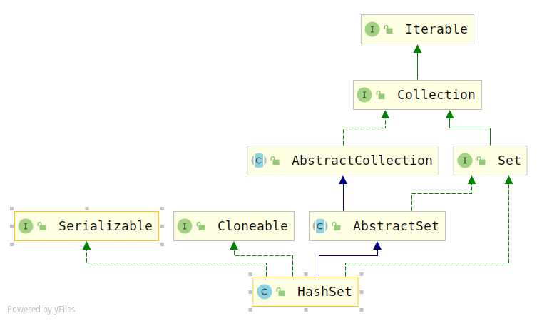

# HashSet源码解析

## 概览



> HashSet：
>
> 1. 实现了`Serializable、Cloneable、Set`接口
> 2. 继承了`AbstractSet`

## 属性

```java
public class HashSet<E>
    extends AbstractSet<E>
    implements Set<E>, Cloneable, java.io.Serializable
{
    static final long serialVersionUID = -5024744406713321676L;

    private transient HashMap<E,Object> map;

    // HashSet中的数据都是存放在Map的key中，Map的value放的就是下面这个常量
    private static final Object PRESENT = new Object();
```

## 构造方法

```java
public HashSet() {
    map = new HashMap<>();
}

/**
 * 构造一个新的HashSet包含指定集合中的元素
*/
public HashSet(Collection<? extends E> c) {
    map = new HashMap<>(Math.max((int) (c.size()/.75f) + 1, 16));
    addAll(c);
}

/**
 * 构造一个新的空set，传入初始容量和负载因子，用于初始化HashMap
*/
public HashSet(int initialCapacity, float loadFactor) {
    map = new HashMap<>(initialCapacity, loadFactor);
}

/**
 * 
*/
public HashSet(int initialCapacity) {
    map = new HashMap<>(initialCapacity);
}

/**
 * 用于创建LinkedHashSet对象
 * Constructs a new, empty linked hash set.  (This package private
 * constructor is only used by LinkedHashSet.) The backing
 * HashMap instance is a LinkedHashMap with the specified initial
 * capacity and the specified load factor.
 *
 * @param      initialCapacity   the initial capacity of the hash map
 * @param      loadFactor        the load factor of the hash map
 * @param      dummy             ignored (distinguishes this
 *             constructor from other int, float constructor.)
 * @throws     IllegalArgumentException if the initial capacity is less
 *             than zero, or if the load factor is nonpositive
 */
HashSet(int initialCapacity, float loadFactor, boolean dummy) {
    map = new LinkedHashMap<>(initialCapacity, loadFactor);
}
```

## 添加元素

```java
public boolean add(E e) {
    return map.put(e, PRESENT)==null;
}
```

很简单，添加多个元素使用的是继承自`AbstractCollection`的`addAll`方法

```java
public boolean addAll(Collection<? extends E> c) {
    boolean modified = false;
    for (E e : c)
        if (add(e))
            modified = true;
    return modified;
}
```

## 删除元素

```java
public boolean remove(Object o) {
    return map.remove(o)==PRESENT;
}
```

就是从map中删除元素，很简单

## 序列化

```java
private void writeObject(java.io.ObjectOutputStream s)
        throws java.io.IOException {
        // Write out any hidden serialization magic
        s.defaultWriteObject();

        // Write out HashMap capacity and load factor
        s.writeInt(map.capacity());
        s.writeFloat(map.loadFactor());

        // Write out size
        s.writeInt(map.size());

        // Write out all elements in the proper order.
        for (E e : map.keySet())
            s.writeObject(e);
    }
```

## 反序列化

```java
private void readObject(java.io.ObjectInputStream s)
    throws java.io.IOException, ClassNotFoundException {
    // Read in any hidden serialization magic
    //读取非静态属性、非transient属性
    s.defaultReadObject();

    // Read capacity and verify non-negative.
    //读取capacity，验证非负值
    int capacity = s.readInt();
    if (capacity < 0) {
        throw new InvalidObjectException("Illegal capacity: " +
                                         capacity);
    }

    // Read load factor and verify positive and non NaN.
    //读取负载因此，验证正数和非数值
    float loadFactor = s.readFloat();
    if (loadFactor <= 0 || Float.isNaN(loadFactor)) {
        throw new InvalidObjectException("Illegal load factor: " +
                                         loadFactor);
    }

    // Read size and verify non-negative.
    //读取size，验证非负数
    int size = s.readInt();
    if (size < 0) {
        throw new InvalidObjectException("Illegal size: " +
                                         size);
    }
    // Set the capacity according to the size and load factor ensuring that
    // the HashMap is at least 25% full but clamping to maximum capacity.
    capacity = (int) Math.min(size * Math.min(1 / loadFactor, 4.0f),
                              HashMap.MAXIMUM_CAPACITY);

    // Constructing the backing map will lazily create an array when the first element is
    // added, so check it before construction. Call HashMap.tableSizeFor to compute the
    // actual allocation size. Check Map.Entry[].class since it's the nearest public type to
    // what is actually created.

    SharedSecrets.getJavaOISAccess()
        .checkArray(s, Map.Entry[].class, HashMap.tableSizeFor(capacity));

    // Create backing HashMap
    map = (((HashSet<?>)this) instanceof LinkedHashSet ?
           new LinkedHashMap<E,Object>(capacity, loadFactor) :
           new HashMap<E,Object>(capacity, loadFactor));

    // Read in all elements in the proper order.
    for (int i=0; i<size; i++) {
        @SuppressWarnings("unchecked")
        E e = (E) s.readObject();
        map.put(e, PRESENT);
    }
}
```


