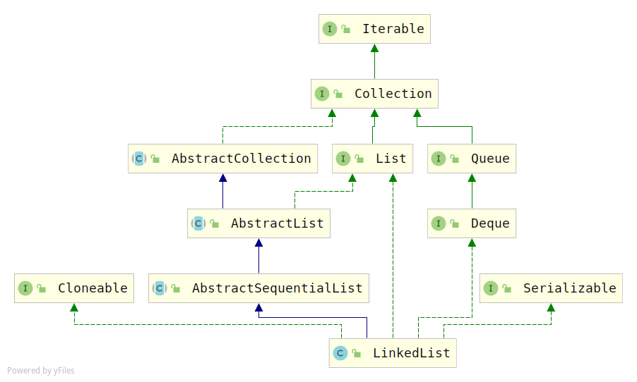

# LinkedList源码解析

## 类图



> 三个接口和`ArrayList`是一致的
>
> 1. `java.util.List`
> 2. `java.io.Serializable`
> 3. `java.lang.Clonable`
>
> 有一个接口少于`ArrayList`的是`java.util.RandomAccess`，因为它不支持随机访问
>
> 有一个接口多于`ArrayList`的是`java.util.Dequeue`，提供了双端队列功能，也就是`LinkedList`支持在头尾快速插入或者读取元素。
>
> 继承了`java.util.AbstractSequentialList`抽象类，它是`AbstractList`的子类，实现了能随机访问数据存储的`get(index)或者add(index, e)`等随机操作方法。

## 属性

```java
public class LinkedList<E>
    extends AbstractSequentialList<E>
    implements List<E>, Deque<E>, Cloneable, java.io.Serializable
{
    transient int size = 0;

    /**
     * 指向第一个节点
     * Invariant: (first == null && last == null) ||
     *            (first.prev == null && first.item != null)
     */
    transient Node<E> first;

    /**
     * 指向最后一个节点
     * Invariant: (first == null && last == null) ||
     *            (last.next == null && last.item != null)
     */
    transient Node<E> last;
    
     private static class Node<E> {
        E item;
        Node<E> next;
        Node<E> prev;

        Node(Node<E> prev, E element, Node<E> next) {
            this.item = element;
            this.next = next;
            this.prev = prev;
        }
    }
```

> 链表共有4个属性（还包括一个序列化id）。
>
> 节点个数`size`，指向第一个和最后一个节点的指针`first和last`
>
> `Node`代表链表中的一个节点，它是一个静态内部类，它有一个指向前后节点的指针

## 构造方法

```java
/**
* 构造空list
*/
public LinkedList() {
}

/**
* 构造包含指定集合元素的list
*/
public LinkedList(Collection<? extends E> c) {
    this();
    addAll(c);
}
```

> 相对于`ArrayList`，它没有容量，所以构造方法简单的多

## 添加单个元素

```java
//添加单个元素
public boolean add(E e) {
    //将元素e连接到最后一个节点后
    linkLast(e);
    return true;
}
//在指定位置添加单个元素
public void add(int index, E element) {
    checkPositionIndex(index);

    if (index == size)
        linkLast(element);
    else
        linkBefore(element, node(index));
}

void linkLast(E e) {
    //保存最后一个几点的指针
    final Node<E> l = last;
    //创建一个新的节点，前驱是最后的节点，后继是null
    final Node<E> newNode = new Node<>(l, e, null);
    //将last指针往后移动一个，指向新建的节点
    last = newNode;
    //如果之前保存的最后节点的指针是null，说明链表本身是空的，此时，将first指针指向当前的新节点
    if (l == null)
        first = newNode;
    else //反之，修改之前最后节点的后继指针，使其指向当前节点
        l.next = newNode;
    size++;  //元素+1
    modCount++; //修改次数+1
}

//将元素插入到某个非空节点之前
void linkBefore(E e, Node<E> succ) {
    // 保存当前节点的前驱节点的指针
    final Node<E> pred = succ.prev;
    //新建一个节点
    final Node<E> newNode = new Node<>(pred, e, succ);
    //修改当前节点的前驱，指向新创建的节点
    succ.prev = newNode;
    //pred为null，说明新节点是掺入到了第一个节点之前，修改first指针指向新建节点
    if (pred == null)
        first = newNode;
    else //反之，修改pred指向的节点的后继指针，让其指向新建节点
        pred.next = newNode;
    size++;
    modCount++;
}
//查找索引idnex处的元素
Node<E> node(int index) {
    //骚操作：将index与链表长度的一半作比较，采用不同的策略，减少比较次数
    if (index < (size >> 1)) {//index 比链表长度一半小，从前往后找
        Node<E> x = first;
        for (int i = 0; i < index; i++)
            x = x.next;
        return x;
    } else {// index比链表长度一半大，从后往前找
        Node<E> x = last;
        for (int i = size - 1; i > index; i--)
            x = x.prev;
        return x;
    }
}
```

> 插入节点可以抽象成两种情况：
>
> 1. 要么是插入到最后一个节点之后
> 2. 其余情况，插入到任何一个几点之前
>
> 插入过程比较简单，不再累述，在头尾插入情况比较特殊，要特别注意。

另外，由于`LinkedList`实现了`Dequeue`接口，它也实现了队列相关的方法。

```java
public boolean offer(E e) {
    return add(e);
}

public boolean offerFirst(E e) {
    addFirst(e);
    return true;
}

public boolean offerLast(E e) {
    addLast(e);
    return true;
}

public E peekFirst() {
    final Node<E> f = first;
    return (f == null) ? null : f.item;
}

public E peekLast() {
    final Node<E> l = last;
    return (l == null) ? null : l.item;
}

public E pollFirst() {
    final Node<E> f = first;
    return (f == null) ? null : unlinkFirst(f);
}

public E pollLast() {
    final Node<E> l = last;
    return (l == null) ? null : unlinkLast(l);
}
```

还有栈相关的操作：

```java
public void push(E e) {
    addFirst(e);
}

public E pop() {
    return removeFirst();
}
```

## 添加多个元素

主要是添加集合

```java
public boolean addAll(Collection<? extends E> c) {
    //在最后一个节点后面添加元素
    return addAll(size, c);
}
//在指定index位置添加元素
public boolean addAll(int index, Collection<? extends E> c) {
    checkPositionIndex(index); //检查index时候合法

    Object[] a = c.toArray(); //先将集合c转换成数组
    int numNew = a.length; //数组长度
    if (numNew == 0)
        return false; //数组长度为0，直接返回

    Node<E> pred, succ;
    //集合元素是插入到最后，还是中间某个节点前面？所以要分两种情况
    if (index == size) { //情况1；index指向了最后的位置
        succ = null;
        pred = last;
    } else {  //情况2：index指向了中间某个节点
        succ = node(index);  //获取这个节点
        pred = succ.prev;  //保存前驱指针
    }
    //遍历，依次插入元素
    for (Object o : a) {
        @SuppressWarnings("unchecked") E e = (E) o;
        Node<E> newNode = new Node<>(pred, e, null);
        if (pred == null)
            first = newNode;
        else
            pred.next = newNode;
        pred = newNode;
    }
	//调整最后插入节点的后继指针
    if (succ == null) { //如果后面没有节点，他就是最后一个节点
        last = pred;  //last指针指向他
    } else {  //如果是中间节点，直接修改指针指向即可
        pred.next = succ;
        succ.prev = pred;
    }

    size += numNew;  //修改size
    modCount++; //修改次数+1
    return true;
}
```

> 过程比较简单

## 删除单个元素

```java
//直接调用remove，默认删除第一个节点
public E remove() {
    return removeFirst();
}
//删除第一个节点
public E removeFirst() {
    final Node<E> f = first;
    if (f == null)
        throw new NoSuchElementException();
    return unlinkFirst(f);
}

//删除最后一个元素
public E removeLast() {
    final Node<E> l = last;
    if (l == null)
        throw new NoSuchElementException();
    return unlinkLast(l);
}

private E unlinkFirst(Node<E> f) {
    // 保存要删除的节点的元素，这个是后面要返回的
    final E element = f.item;
    //保存下一个节点的指针
    final Node<E> next = f.next;
    //当前节点各个字段置null，方便垃圾回收
    f.item = null;
    f.next = null; // help GC
    //first指向下一个节点
    first = next;
    if (next == null) //如果删除的是最后一个节点
        last = null;  //修改last指针
    else  //反之，修改next节点的前驱指针，指向null
        next.prev = null;
    size--;  //size-1
    modCount++;  //修改次数+1
    return element;  //返回删除的元素
}

private E unlinkLast(Node<E> l) {
    // 记录当前节点的元素内容
    final E element = l.item;
    //记录前驱
    final Node<E> prev = l.prev;
    //字段置null，方便垃圾回收
    l.item = null;
    l.prev = null; // help GC 
    //last指针指向前驱
    last = prev; 
    if (prev == null)  //如果删除的当前节点是第一个节点，修改first指针
        first = null;
    else  //反之，修改前驱节点的后继指针为null
        prev.next = null;
    size--;
    modCount++;
    return element;
}
```

LinkedList还提供了删除第一个发现的元素或者删除最后一个发现的元素的功能

```java
//删除指定元素在链表中第一次出现的节点
public boolean removeFirstOccurrence(Object o) {
    return remove(o);
}
//删除指定元素在链表中最后出现的节点
public boolean removeLastOccurrence(Object o) {
    if (o == null) {
        for (Node<E> x = last; x != null; x = x.prev) {
            if (x.item == null) {
                unlink(x);
                return true;
            }
        }
    } else {
        for (Node<E> x = last; x != null; x = x.prev) {
            if (o.equals(x.item)) {
                unlink(x);
                return true;
            }
        }
    }
    return false;
}

public boolean remove(Object o) {
    if (o == null) {
        //如果是null
        for (Node<E> x = first; x != null; x = x.next) {
            if (x.item == null) {
                unlink(x);
                return true;
            }
        }
    } else {
        for (Node<E> x = first; x != null; x = x.next) {
            if (o.equals(x.item)) {
                unlink(x);
                return true;
            }
        }
    }
    return false;
}
```

## 删除多个元素

```java
//AbstractCollection.java 
public boolean removeAll(Collection<?> c) {
        Objects.requireNonNull(c);
        boolean modified = false;
        Iterator<?> it = iterator();
        while (it.hasNext()) {
            if (c.contains(it.next())) {
                it.remove();
                modified = true;
            }
        }
        return modified;
    }
```

> 比较简单，通过Iterator迭代器遍历list，判断集合c中是否包含指定指定元素，进而在list删除之

## 获取指定位置的元素

```java
//获取指定索引的元素
public E get(int index) {
    checkElementIndex(index);
    return node(index).item;
}

public E getFirst() {
    final Node<E> f = first;
    if (f == null)
        throw new NoSuchElementException();
    return f.item;
}

public E getLast() {
    final Node<E> l = last;
    if (l == null)
        throw new NoSuchElementException();
    return l.item;
}
```

## 修改元素内容

```java
public E set(int index, E element) {
    checkElementIndex(index);
    Node<E> x = node(index);
    E oldVal = x.item;
    x.item = element;
    return oldVal;  //返回旧值
}
```

## 转换成数组

```java
public Object[] toArray() {
    //新建一个大小为size的Object数组
    Object[] result = new Object[size]; 
    int i = 0;
    //遍历链表，将元素方法数组
    for (Node<E> x = first; x != null; x = x.next)
        result[i++] = x.item;
    return result;
}
```

## 序列化

```java
private void writeObject(java.io.ObjectOutputStream s)
    throws java.io.IOException {
    // Write out any hidden serialization magic
    s.defaultWriteObject();

    // Write out size
    s.writeInt(size);

    // Write out all elements in the proper order.
    for (Node<E> x = first; x != null; x = x.next)
        s.writeObject(x.item);
}
```

## 反序列化

```java
private void readObject(java.io.ObjectInputStream s)
    throws java.io.IOException, ClassNotFoundException {
    // Read in any hidden serialization magic
    s.defaultReadObject();

    // Read in size
    int size = s.readInt();

    // Read in all elements in the proper order.
    for (int i = 0; i < size; i++)
        linkLast((E)s.readObject());
}
```

## 克隆

```java
public Object clone() {
    //调用父类，进行克隆
    LinkedList<E> clone = superClone();

    // 设置原始状态
    clone.first = clone.last = null;
    clone.size = 0;
    clone.modCount = 0;

    // 遍历每个元素，初始化
    for (Node<E> x = first; x != null; x = x.next)
        clone.add(x.item);

    return clone;
}
```

## 迭代器Iterator

```java
//AbstractSequentialList.java 
public Iterator<E> iterator() {
    return listIterator();
}
//AbstractList.java
public ListIterator<E> listIterator() {
    return listIterator(0);
}
//LinkedList.java
public ListIterator<E> listIterator(int index) {
    checkPositionIndex(index);
    return new ListItr(index);
}
```

而ListItr类为：

```java
private class ListItr implements ListIterator<E> {
    private Node<E> lastReturned;  //指向最后一次返回的节点
    private Node<E> next;  //指向下一个要访问的节点
    private int nextIndex; //下一个节点的索引
    private int expectedModCount = modCount;  //创建迭代器时，数组修改次数

    ListItr(int index) {
        // assert isPositionIndex(index);
        next = (index == size) ? null : node(index);
        nextIndex = index;
    }

    public boolean hasNext() {
        return nextIndex < size;
    }

    public E next() {
        checkForComodification();
        if (!hasNext())
            throw new NoSuchElementException();

        lastReturned = next;
        next = next.next;
        nextIndex++;
        return lastReturned.item;
    }

    public boolean hasPrevious() {
        return nextIndex > 0;
    }

    public E previous() {
        checkForComodification();
        if (!hasPrevious())
            throw new NoSuchElementException();

        lastReturned = next = (next == null) ? last : next.prev;
        nextIndex--;
        return lastReturned.item;
    }

    public int nextIndex() {
        return nextIndex;
    }

    public int previousIndex() {
        return nextIndex - 1;
    }

    public void remove() {
        checkForComodification();
        if (lastReturned == null)
            throw new IllegalStateException();

        Node<E> lastNext = lastReturned.next;
        unlink(lastReturned);
        if (next == lastReturned)
            next = lastNext;
        else
            nextIndex--;
        lastReturned = null;
        expectedModCount++;
    }

    public void set(E e) {
        if (lastReturned == null)
            throw new IllegalStateException();
        checkForComodification();
        lastReturned.item = e;
    }

    public void add(E e) {
        checkForComodification();
        lastReturned = null;
        if (next == null)
            linkLast(e);
        else
            linkBefore(e, next);
        nextIndex++;
        expectedModCount++;
    }

    public void forEachRemaining(Consumer<? super E> action) {
        Objects.requireNonNull(action);
        while (modCount == expectedModCount && nextIndex < size) {
            action.accept(next.item);
            lastReturned = next;
            next = next.next;
            nextIndex++;
        }
        checkForComodification();
    }

    final void checkForComodification() {
        if (modCount != expectedModCount)
            throw new ConcurrentModificationException();
    }
}
```

