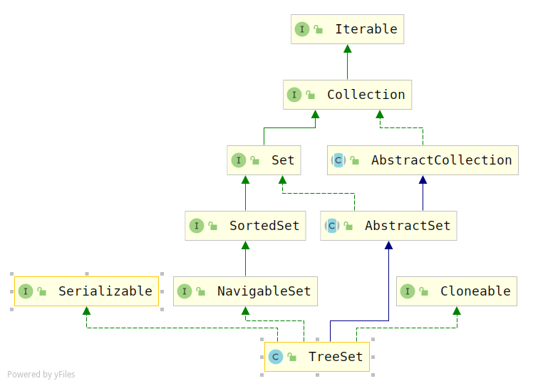

# TreeSet源码解析

## 概述

Set具有排重的特性，TreeSet基于TreeMap，在排重的基础上加了一个排序的功能。

## 类图



> 相比于HashSet，多实现了一个接口`java.util.NavigableSet`，它的作用是：可以以升序或者降序对map进行遍历访问。

## 属性

```java
public class TreeSet<E> extends AbstractSet<E>
    implements NavigableSet<E>, Cloneable, java.io.Serializable
{
    /**
     * The backing map.
     */
    private transient NavigableMap<E,Object> m;

    // Dummy value to associate with an Object in the backing Map
    private static final Object PRESENT = new Object();

```

> 和HashSet很类似，不同的是这里的Map的类型是：`NavigableSet`

## 构造方法

```java
/**
 * 使用指定的map进行初始化
 */
TreeSet(NavigableMap<E,Object> m) {
    this.m = m;
}

/**
 * 创建一个新的，空set，按元素的自然顺序进行排序，所有的元素都必须实现Comparable接口
 */
public TreeSet() {
    this(new TreeMap<E,Object>());
}

/**
 * 创建一个新的，空set，按元素自然顺序进行排序，所有元素都能使用指定的comparator排序
 * 
 */
public TreeSet(Comparator<? super E> comparator) {
    this(new TreeMap<>(comparator));
}

/**
 * 创建一个新的，空set，使用指定集合中的元素对set进行初始化
 */
public TreeSet(Collection<? extends E> c) {
    this();
    addAll(c);
}

/**创建一个新的，空set，使用指定集合中的元素对set进行初始化，复用s的comparator
 */
public TreeSet(SortedSet<E> s) {
    this(s.comparator());
    addAll(s);
}
```

## 添加元素

```java
public boolean add(E e) {
    return m.put(e, PRESENT)==null;
}

public  boolean addAll(Collection<? extends E> c) {
    // 情况1
    if (m.size()==0 && c.size() > 0 &&
        c instanceof SortedSet &&
        m instanceof TreeMap) {
        SortedSet<? extends E> set = (SortedSet<? extends E>) c;
        TreeMap<E,Object> map = (TreeMap<E, Object>) m;
        Comparator<?> cc = set.comparator();
        Comparator<? super E> mc = map.comparator();
        if (cc==mc || (cc != null && cc.equals(mc))) {
            map.addAllForTreeSet(set, PRESENT);
            return true;
        }
    }
    return super.addAll(c);
}
```

## 删除元素

```java
public boolean remove(Object o) {
    return m.remove(o)==PRESENT;
}
```

## 查找最接近的元素

> 在`NavigableSet`中定义了四个查找接近的元素
>
> 1. `lower(E e)`：小于
> 2. `floor(E e)`：小于等于
> 3. `higher(E e)`：大于
> 4. `ceiling(E e)`：大于等于

```java
public E lower(E e) {
    return m.lowerKey(e); 
}

public E floor(E e) {
    return m.floorKey(e);
}


public E higher(E e) {
    return m.higherKey(e);
}

public E ceiling(E e) {
    return m.ceilingKey(e);
}
```

## 序列化

```java
private void writeObject(java.io.ObjectOutputStream s)
    throws java.io.IOException {
    // Write out any hidden stuff
    s.defaultWriteObject();

    // Write out Comparator
    s.writeObject(m.comparator());

    // Write out size
    s.writeInt(m.size());

    // Write out all elements in the proper order.
    for (E e : m.keySet())
        s.writeObject(e);
}
```

## 反序列化

```java
private void readObject(java.io.ObjectInputStream s)
    throws java.io.IOException, ClassNotFoundException {
    // Read in any hidden stuff
    s.defaultReadObject();

    // Read in Comparator
    @SuppressWarnings("unchecked")
    Comparator<? super E> c = (Comparator<? super E>) s.readObject();

    // Create backing TreeMap
    TreeMap<E,Object> tm = new TreeMap<>(c);
    m = tm;

    // Read in size
    int size = s.readInt();

    tm.readTreeSet(size, s, PRESENT);
}
```

