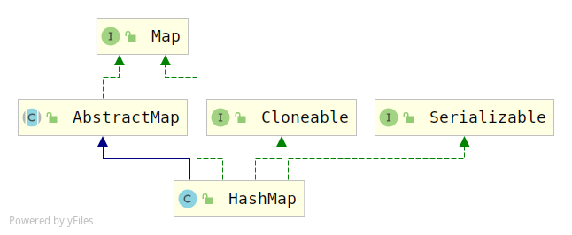

# HashMap源码分析（jdk1.7）

## 类图



> HashMap实现了`java.lang.Cloneable`和`java.io.Serializable`接口
>
> 继承了`AbstractMap`抽象类

## 属性

主要列出了一些核心变量

```java
public class HashMap<K,V>
    extends AbstractMap<K,V>
    implements Map<K,V>, Cloneable, Serializable
{

    /**
     * 默认的存储容量16，必须是2的幂次方
     */
    static final int DEFAULT_INITIAL_CAPACITY = 1 << 4; // aka 16

    /**
     * 最大容量2^30
     */
    static final int MAXIMUM_CAPACITY = 1 << 30;

    /**
     * 默认负载因子0.75
     */
    static final float DEFAULT_LOAD_FACTOR = 0.75f;

    /**
     * 用于共享的空实例
     */
    static final Entry<?,?>[] EMPTY_TABLE = {};

    /**
     * map中存储数据的table数组
     */
    transient Entry<K,V>[] table = (Entry<K,V>[]) EMPTY_TABLE;

    /**
     * map中键值对的个数
     */
    transient int size;

    /**
     * 扩容阀值 (capacity * load factor).
     */
    int threshold;

    /**
     * 负载因子
     */
    final float loadFactor;

    /**
     * HashMap被结构化修改的次数
     * 所谓结构化修改是指：HashMap中键值对的数量变了（发生了添加/删除)，或者修改了内部的结构(rehash)
     * 这个变量用于快速失败（fail-fast)
     */
    transient int modCount;
    
    /**
     * 一个随机值，用到key的hashcode方法中，减少hash碰撞
     */
    transient int hashSeed = 0;
    
    //map的键值对的set集合
    private transient Set<Map.Entry<K,V>> entrySet = null;
    
    transient volatile Set<K>        keySet = null;
    transient volatile Collection<V> values = null;

```

## 节点数据结构Entry

```java
static class Entry<K,V> implements Map.Entry<K,V> {
        final K key; 
        V value;
        Entry<K,V> next;
        int hash;

        /**
         * Creates new entry.
         */
        Entry(int h, K k, V v, Entry<K,V> n) {
            value = v;
            next = n;
            key = k;
            hash = h;
        }
```

这个就是底层链表存储数据的数据结构

## 构造函数

```java
//根据指定的初始容量和指定的负载因子构造HashMap
public HashMap(int initialCapacity, float loadFactor) {
     //初始容量变量检查
    if (initialCapacity < 0) 
        throw new IllegalArgumentException("Illegal initial capacity: " +
                                           initialCapacity);
    //如果初始容量比最大容量都大，那么就使用默认的最大容量
    if (initialCapacity > MAXIMUM_CAPACITY)
        initialCapacity = MAXIMUM_CAPACITY;
    //负载因子变量检查
    if (loadFactor <= 0 || Float.isNaN(loadFactor))
        throw new IllegalArgumentException("Illegal load factor: " +
                                           loadFactor);
	//设置负载因子
    this.loadFactor = loadFactor;
    //阀值默认是初始化容量，在put函数中会进行调整
    threshold = initialCapacity;
    init();  //空方法，子类实现
}

/**
 * 构造HashMap，指定初始化容量，使用默认的负载因子0.75
 */
public HashMap(int initialCapacity) {
    this(initialCapacity, DEFAULT_LOAD_FACTOR);
}

/**
 * 构造HashMap，使用默认初始容量16和默认负载因子0.75
 */
public HashMap() {
    this(DEFAULT_INITIAL_CAPACITY, DEFAULT_LOAD_FACTOR);
}

/**
 * 使用指定的Map初始化HashMap
*/
public HashMap(Map<? extends K, ? extends V> m) {
    //计算初始化容量，并初始化一个Map
    this(Math.max((int) (m.size() / DEFAULT_LOAD_FACTOR) + 1,
                  DEFAULT_INITIAL_CAPACITY), DEFAULT_LOAD_FACTOR);
    //为HashMap中其他的变量填充初始值
    inflateTable(threshold);
	//添加集合元素
    putAllForCreate(m);
}
```

## 添加单个元素

```java
public V put(K key, V value) {
    //如果table数组是空的，则先创建一个数组，入参是threshold，默认是initialCapacity=16
    if (table == EMPTY_TABLE) {
        inflateTable(threshold);
    }
    //可以put key为null的值
    if (key == null)
        return putForNullKey(value);
    //对传入的key计算hash值
    int hash = hash(key);
    //计算key对应的数组桶的位置
    int i = indexFor(hash, table.length); //h & (length-1);
    //找到桶的位置后，接下来就是遍历链表，填充元素
    for (Entry<K,V> e = table[i]; e != null; e = e.next) {
        Object k;
        //已经存在key相同并且value相同的元素，把值替换掉，返回旧值
        if (e.hash == hash && ((k = e.key) == key || key.equals(k))) {
            V oldValue = e.value;
            e.value = value;
            e.recordAccess(this);
            return oldValue;
        }
    }
	//反之，桶中不存在元素，则将元素添加到map中去
    modCount++;  //修改次数+1
    addEntry(hash, key, value, i); //添加元素
    return null;
}

//填充数组
private void inflateTable(int toSize) {
    // 找一个大于等于toSize的最小2次幂，作为数组的容量
    int capacity = roundUpToPowerOf2(toSize);
	//根据数组容量和负载因子计算阀值
    threshold = (int) Math.min(capacity * loadFactor, MAXIMUM_CAPACITY + 1);
    //创建新Entry数组
    table = new Entry[capacity];
    //初始化种子变量
    initHashSeedAsNeeded(capacity);
}

//计算大于等于number的最小2次幂
private static int roundUpToPowerOf2(int number) {
    // assert number >= 0 : "number must be non-negative";
    return number >= MAXIMUM_CAPACITY
        ? MAXIMUM_CAPACITY
        : (number > 1) ? Integer.highestOneBit((number - 1) << 1) : 1;
}
```

我们看一下`addEntry`函数

```java
//添加一个键值对
void addEntry(int hash, K key, V value, int bucketIndex) {
    //如果当前map中键值对的size已经达到阀值，并且当前桶中存在元素，则扩容
    if ((size >= threshold) && (null != table[bucketIndex])) {
        //数组扩容为当前容量的2倍
        resize(2 * table.length);
        //数组长度变了，重写计算hash值和元素在桶中的索引
        hash = (null != key) ? hash(key) : 0;
        bucketIndex = indexFor(hash, table.length);
    }
	//创建entry
    createEntry(hash, key, value, bucketIndex);
}

void createEntry(int hash, K key, V value, int bucketIndex) {
    //头插入，将新的节点插入到链表头
    Entry<K,V> e = table[bucketIndex];
    table[bucketIndex] = new Entry<>(hash, key, value, e);
    size++;
}
```

> 注意点：
>
> 1. 添加元素之前，首先判断map是否为空，更确切的说，是判断`Entry[]`数组是否为空，如果为空，则创建一个新数组，数组容量是大于等于传入的`threshold`的最小2次幂；新数组创建完成后，就是添加元素了：先计算元素的hash值 ，根据hash值计算桶的位置，然后，遍历桶中的链表，如果已存在hash值相等的元素，则用新值替换旧值；反之，则将<font color=red>元素添加到链表的头部（注意头插法）</font>。
> 2. 在往链表头部添加元素之前，会先判断map的size是否已经达到了阀值，如果达到了阀值，则将`Entry[]`数组扩容为<font color=red>原数组2倍</font>

## 扩容

扩容是通过`resize()`操作

```java
void resize(int newCapacity) {
    //先保存旧数组
    Entry[] oldTable = table;
    //获取旧数组长度
    int oldCapacity = oldTable.length;
    //如果旧数组容量已经达到了最大容量，不会resize，而是调整阀值为Integer.MAX_VALUE，返回
    if (oldCapacity == MAXIMUM_CAPACITY) {
        threshold = Integer.MAX_VALUE;
        return;
    }
	//新建一个Entry数组，容量是newCapacity
    Entry[] newTable = new Entry[newCapacity];
    //将旧数组里面的键值对转移到新数组
    transfer(newTable, initHashSeedAsNeeded(newCapacity));
    //table指向新数组
    table = newTable;
    //调整阀值
    threshold = (int)Math.min(newCapacity * loadFactor, MAXIMUM_CAPACITY + 1);
}
//将旧数组数据转移到新数组
void transfer(Entry[] newTable, boolean rehash) {
    //记录新数组长度
    int newCapacity = newTable.length;
    //遍历旧数组，将旧数组中的数据转移到新数组
    for (Entry<K,V> e : table) {
        while(null != e) {//当桶中对应的数据不为空，则遍历这个桶对应的链表
            //先将next指针后移一个
            Entry<K,V> next = e.next;
            //如果需要rehash的话，重新计算key的hash值
            if (rehash) {
                e.hash = null == e.key ? 0 : hash(e.key);
            }
            //根据key的hash值，找桶的位置
            int i = indexFor(e.hash, newCapacity);
            //将数据添加到桶对应的链表表头
            e.next = newTable[i];
            newTable[i] = e;
            //遍历指针后移
            e = next;
        }
    }
}
```

> 注意点：
>
> 1. 根据传入的`newCapacity`进行扩容，不过，也不是说一定会扩容，当旧的`Entry[]`数组的容量达到了限定的最大值（即：`MAXIMUM_CAPACITY=2^30`），不会扩容，而是调整`threshold=Integer.MAX_VALUE(即：2^31)`，然后，直接返回
> 2. 如果成功扩容，则需要将旧数组中的数据转移到新数组，这个过程会进行`rehash`
> 3. 元素在链表中是采用头插法

## 添加多个元素

```java
public void putAll(Map<? extends K, ? extends V> m) {
    int numKeysToBeAdded = m.size();
    if (numKeysToBeAdded == 0)
        return; //指定的集合为空，直接返回
 	//如果当前map为空，先初始化map
    if (table == EMPTY_TABLE) {
        inflateTable((int) Math.max(numKeysToBeAdded * loadFactor, threshold));
    }

    /*
         * Expand the map if the map if the number of mappings to be added
         * is greater than or equal to threshold.  This is conservative; the
         * obvious condition is (m.size() + size) >= threshold, but this
         * condition could result in a map with twice the appropriate capacity,
         * if the keys to be added overlap with the keys already in this map.
         * By using the conservative calculation, we subject ourself
         * to at most one extra resize.
         */
    if (numKeysToBeAdded > threshold) {
        int targetCapacity = (int)(numKeysToBeAdded / loadFactor + 1);
        if (targetCapacity > MAXIMUM_CAPACITY)
            targetCapacity = MAXIMUM_CAPACITY;
        int newCapacity = table.length;
        while (newCapacity < targetCapacity)
            newCapacity <<= 1;
        if (newCapacity > table.length)
            resize(newCapacity);
    }

    for (Map.Entry<? extends K, ? extends V> e : m.entrySet())
        put(e.getKey(), e.getValue());
}
```

## 删除指定key的元素

```java
public V remove(Object key) {
    Entry<K,V> e = removeEntryForKey(key);
    return (e == null ? null : e.value);
}

//删除指定key的键值对（Entry）
final Entry<K,V> removeEntryForKey(Object key) {
    //map为空，直接返回
    if (size == 0) {
        return null;
    }
    //map不为空，先计算key的hash值
    int hash = (key == null) ? 0 : hash(key);
    //根据hash值，定位桶的位置
    int i = indexFor(hash, table.length);
    Entry<K,V> prev = table[i];
    Entry<K,V> e = prev;

    while (e != null) {
        //记录下一节点指针
        Entry<K,V> next = e.next;
        Object k;
        //找到了hash值相等并且key相等的
        if (e.hash == hash &&
            ((k = e.key) == key || (key != null && key.equals(k)))) {
            modCount++; //修改次数+1
            size--; //size-1
            if (prev == e) //第一个节点
                table[i] = next;
            else //其他节点
                prev.next = next;
            e.recordRemoval(this);
            return e;
        }
        prev = e;
        e = next;
    }

    return e;
}
```

很简单，主要是要注意第一个节点的删除。

## 获取元素

```java
//根据key获取元素
public V get(Object key) {
    if (key == null) //如果key是null
        return getForNullKey(); 
    //获取键值对
    Entry<K,V> entry = getEntry(key);
	//entry为空，则返回空；反之，返回对应的值
    return null == entry ? null : entry.getValue();
}

private V getForNullKey() {
    if (size == 0) {
        return null;
    }
    for (Entry<K,V> e = table[0]; e != null; e = e.next) {
        if (e.key == null)
            return e.value;
    }
    return null;
}
```

## entryset遍历

```java
//返回map中键值对的set集合
public Set<Map.Entry<K,V>> entrySet() {
    return entrySet0();
}

private Set<Map.Entry<K,V>> entrySet0() {
    Set<Map.Entry<K,V>> es = entrySet;
    return es != null ? es : (entrySet = new EntrySet()); //如果entryset为空，则新建一个entryset
}
```

这个有个内部类`EntrySet`，它继承的是`AbstractSet`

```java
private final class EntrySet extends AbstractSet<Map.Entry<K,V>> {
    public Iterator<Map.Entry<K,V>> iterator() {
        return newEntryIterator();
    }
    public boolean contains(Object o) {
        if (!(o instanceof Map.Entry))
            return false;
        Map.Entry<K,V> e = (Map.Entry<K,V>) o;
        Entry<K,V> candidate = getEntry(e.getKey());
        return candidate != null && candidate.equals(e);
    }
    public boolean remove(Object o) {
        return removeMapping(o) != null;
    }
    public int size() {
        return size;
    }
    public void clear() {
        HashMap.this.clear();
    }
}

Iterator<Map.Entry<K,V>> newEntryIterator()   {
    return new EntryIterator();
}
```

我们看一下`EntryIterator`，它继承的是`HashIterator`

```java
private final class EntryIterator extends HashIterator<Map.Entry<K,V>> {
    public Map.Entry<K,V> next() {
        return nextEntry();
    }
}
```

我们看一下`HashIterator`，它也是一个内部类，最终的操作类是在这里

```java
private abstract class HashIterator<E> implements Iterator<E> {
    Entry<K,V> next;        // next entry to return
    int expectedModCount;   // For fast-fail
    int index;              // current slot
    Entry<K,V> current;     // current entry

    HashIterator() {
        expectedModCount = modCount;
        if (size > 0) { // advance to first entry
            Entry[] t = table; 
            while (index < t.length && (next = t[index++]) == null)
                ;//指定移动到数值中第一个元素不为空的位置
        }
    }

    public final boolean hasNext() {
        return next != null;
    }

    final Entry<K,V> nextEntry() {
        if (modCount != expectedModCount) 
            throw new ConcurrentModificationException();
        Entry<K,V> e = next;
        if (e == null)
            throw new NoSuchElementException();

        if ((next = e.next) == null) {
            Entry[] t = table;
            while (index < t.length && (next = t[index++]) == null)
                ;
        }
        current = e;
        return e;
    }

    public void remove() {
        if (current == null)
            throw new IllegalStateException();
        if (modCount != expectedModCount)
            throw new ConcurrentModificationException();
        Object k = current.key;
        current = null;
        HashMap.this.removeEntryForKey(k);
        expectedModCount = modCount;
    }
}
```

> 迭代器最终是落在了`HashIterator`上。

## keyset遍历

```java
public Set<K> keySet() {
    Set<K> ks = keySet;
    return (ks != null ? ks : (keySet = new KeySet()));
}

private final class KeySet extends AbstractSet<K> {	
    public Iterator<K> iterator() {
        return newKeyIterator();
    }
    public int size() {
        return size;
    }
    public boolean contains(Object o) {
        return containsKey(o);
    }
    public boolean remove(Object o) {
        return HashMap.this.removeEntryForKey(o) != null;
    }
    public void clear() {
        HashMap.this.clear();
    }
}

Iterator<K> newKeyIterator()   {
    return new KeyIterator();
}

private final class KeyIterator extends HashIterator<K> {
    //这里重写了next方法，本质上还是用的是HashIterator
    public K next() {
        return nextEntry().getKey();
    }
}
```

> keyset遍历还是复用了底层的`HashIterator`方法

## values遍历

```java
public Collection<V> values() {
    Collection<V> vs = values;
    return (vs != null ? vs : (values = new Values()));
}

private final class Values extends AbstractCollection<V> {
    public Iterator<V> iterator() {
        return newValueIterator();
    }
    public int size() {
        return size;
    }
    public boolean contains(Object o) {
        return containsValue(o);
    }
    public void clear() {
        HashMap.this.clear();
    }
}

Iterator<V> newValueIterator()   {
    return new ValueIterator();
}

private final class ValueIterator extends HashIterator<V> {
    public V next() {
        //还是复用的HashIterator
        return nextEntry().value;
    }
}
```

> 三个遍历本质上都是一样的，底层都是用的`HashIterator`

## 序列化

```java
private void writeObject(java.io.ObjectOutputStream s)
    throws IOException
    {
        // Write out the threshold, loadfactor, and any hidden stuff
        s.defaultWriteObject();

        // Write out number of buckets
        if (table==EMPTY_TABLE) {
            s.writeInt(roundUpToPowerOf2(threshold));
        } else {
           s.writeInt(table.length);
        }

        // Write out size (number of Mappings)
        s.writeInt(size);

        // Write out keys and values (alternating)
        if (size > 0) {
            for(Map.Entry<K,V> e : entrySet0()) {
                s.writeObject(e.getKey());
                s.writeObject(e.getValue());
            }
        }
    }
```

## 反序列化

```java
private void readObject(java.io.ObjectInputStream s)
    throws IOException, ClassNotFoundException
    {
        // Read in the threshold (ignored), loadfactor, and any hidden stuff
        s.defaultReadObject();
        if (loadFactor <= 0 || Float.isNaN(loadFactor)) {
            throw new InvalidObjectException("Illegal load factor: " +
                                               loadFactor);
        }

        // set other fields that need values
        table = (Entry<K,V>[]) EMPTY_TABLE;

        // Read in number of buckets
        s.readInt(); // ignored.

        // Read number of mappings
        int mappings = s.readInt();
        if (mappings < 0)
            throw new InvalidObjectException("Illegal mappings count: " +
                                               mappings);

        // capacity chosen by number of mappings and desired load (if >= 0.25)
        int capacity = (int) Math.min(
                    mappings * Math.min(1 / loadFactor, 4.0f),
                    // we have limits...
                    HashMap.MAXIMUM_CAPACITY);

        // allocate the bucket array;
        if (mappings > 0) {
            inflateTable(capacity);
        } else {
            threshold = capacity;
        }

        init();  // Give subclass a chance to do its thing.

        // Read the keys and values, and put the mappings in the HashMap
        for (int i = 0; i < mappings; i++) {
            K key = (K) s.readObject();
            V value = (V) s.readObject();
            putForCreate(key, value);
        }
    }
```

## 清空

```java
public void clear() {
    modCount++;
    Arrays.fill(table, null);
    size = 0;
}
```

## HashMap1.7的问题

### 1. 并发情况下，rehash死循环

> rehash转移链表元素采用的是头插法，它会使转移后的元素的位置反转。那么，在并发的情况下，假设有两个联系A，B，都在进行rehash操作，两个线程的指针都指向了`node1`，线程A rehash使得一个链表中原有的两个节点`node1 -> node2`在转移以后变成了`node2->node1`，此时，线程B rehash，`node1->node2->node1`发生了死循环。