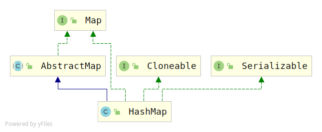
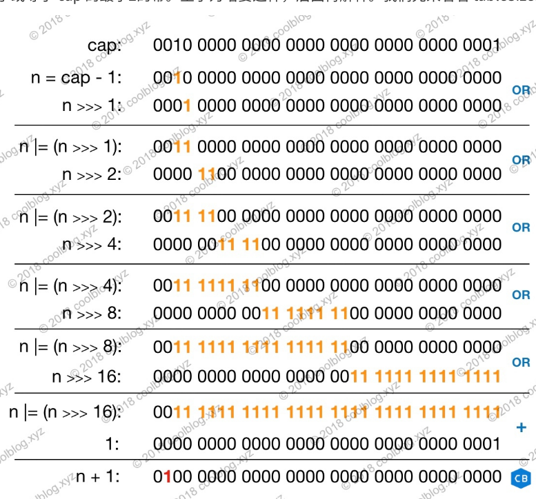

# HashMap源码解析（jdk1.8）

## 概览

> 1. HashMap在jdk1.8采用的是数组+链表+红黑树实现的

## 类图



## 属性变量

```java
public class HashMap<K,V> extends AbstractMap<K,V>
    implements Map<K,V>, Cloneable, Serializable {

    private static final long serialVersionUID = 362498820763181265L;

    /**
     * 默认初始化容量，默认16
     */
    static final int DEFAULT_INITIAL_CAPACITY = 1 << 4; // aka 16

    /**
     * 最大容量2^30
     */
    static final int MAXIMUM_CAPACITY = 1 << 30;

    /**
     * 负载因子0.75
     */
    static final float DEFAULT_LOAD_FACTOR = 0.75f;

    /**
	 * 链表升级成红黑树的节点的最小个数
     */
    static final int TREEIFY_THRESHOLD = 8;

    /**
	 * 树节点个数小于6个将会退化为链表
     */
    static final int UNTREEIFY_THRESHOLD = 6;

    /**
	 * 数组容量大于等于64时，如果超过阀值，相关的链表节点才会树化；否则，会优先扩容
     */
    static final int MIN_TREEIFY_CAPACITY = 64;
    
    /* 底层存储数据的数组 */
    transient Node<K,V>[] table;

    /**
     * 保存键值对
     */
    transient Set<Map.Entry<K,V>> entrySet;

    /**
     * 键值对个数
     */
    transient int size;

    /**
     * 结构变化的次数
     */
    transient int modCount;

    /**
     * 扩容的阀值
    int threshold;

    /**
	 * 负载因子
     */
    final float loadFactor;
```

## 节点数据结构Node

```java
static class Node<K,V> implements Map.Entry<K,V> {
    final int hash;
    final K key;
    V value;
    Node<K,V> next;

    Node(int hash, K key, V value, Node<K,V> next) {
        this.hash = hash;
        this.key = key;
        this.value = value;
        this.next = next;
    }

    public final K getKey()        { return key; }
    public final V getValue()      { return value; }
    public final String toString() { return key + "=" + value; }

    public final int hashCode() {
        return Objects.hashCode(key) ^ Objects.hashCode(value);
    }

    public final V setValue(V newValue) {
        V oldValue = value;
        value = newValue;
        return oldValue;
    }

    public final boolean equals(Object o) {
        if (o == this)
            return true;
        if (o instanceof Map.Entry) {
            Map.Entry<?,?> e = (Map.Entry<?,?>)o;
            if (Objects.equals(key, e.getKey()) &&
                Objects.equals(value, e.getValue()))
                return true;
        }
        return false;
    }
}
```

> 1.7节点数据结构采用的是`Entry`，1.8改成了`Node`

## 红黑树节点数据结构

这里要注意他继承的是`LinkedHashMap.Entry`

```java
static final class TreeNode<K,V> extends LinkedHashMap.Entry<K,V> {
    TreeNode<K,V> parent;  // red-black tree links
    TreeNode<K,V> left;
    TreeNode<K,V> right;
    TreeNode<K,V> prev;    // needed to unlink next upon deletion
    boolean red;
    TreeNode(int hash, K key, V val, Node<K,V> next) {
        super(hash, key, val, next);
    }
```

## 构造函数

```java
//1. 自定义初始容量和负载因子
public HashMap(int initialCapacity, float loadFactor) {
    //初始化容量合法性检查
    if (initialCapacity < 0)
        throw new IllegalArgumentException("Illegal initial capacity: " +
                                           initialCapacity);
    // 指定的初始化容量超过限制的最大值，则按最大值处理
    if (initialCapacity > MAXIMUM_CAPACITY)
        initialCapacity = MAXIMUM_CAPACITY;
    //负载因子合法性检查
    if (loadFactor <= 0 || Float.isNaN(loadFactor))
        throw new IllegalArgumentException("Illegal load factor: " +
                                           loadFactor);
    this.loadFactor = loadFactor;
    //根据初始化容量初始化阀值
    this.threshold = tableSizeFor(initialCapacity);
}

/**
 * 2. 自定义初始化容量，使用默认负载因子0.75
 */
public HashMap(int initialCapacity) {
    this(initialCapacity, DEFAULT_LOAD_FACTOR);
}

/**
 * 3.使用默认的初始化容量和负载因子
 */
public HashMap() {
    this.loadFactor = DEFAULT_LOAD_FACTOR; // all other fields defaulted
}

/**
 * 4. 使用指定的map初始化新的map
 */
public HashMap(Map<? extends K, ? extends V> m) {
    this.loadFactor = DEFAULT_LOAD_FACTOR;
    putMapEntries(m, false);
}
```

看一下`tablesizeFor`函数

```java
static final int tableSizeFor(int cap) {
    int n = cap - 1;
    n |= n >>> 1;
    n |= n >>> 2;
    n |= n >>> 4;
    n |= n >>> 8;
    n |= n >>> 16;
    return (n < 0) ? 1 : (n >= MAXIMUM_CAPACITY) ? MAXIMUM_CAPACITY : n + 1;
}
```

> 它的作用就是找到大约等于cap的最小2次幂
>
> 
>
> 过程如上面这个图所示

## 添加数据

```java
public V put(K key, V value) {
    return putVal(hash(key), key, value, false, true);
}

/**
 *@param onlyIfAbsent if true, don't change existing value
 *@param evict if false, the table is in creation mode.
 */
final V putVal(int hash, K key, V value, boolean onlyIfAbsent,
               boolean evict) {
    Node<K,V>[] tab; Node<K,V> p; int n, i;
    //底层数组为空，或者长度为0，则初始化（数组的延迟初始化）
    if ((tab = table) == null || (n = tab.length) == 0)
        n = (tab = resize()).length;
    //如果计算出的索引对应的桶的位置为空，即没有元素，则直接创建节点，放入
    if ((p = tab[i = (n - 1) & hash]) == null)
        tab[i] = newNode(hash, key, value, null);
    else { //反之，就是桶中已经有元素了，产生冲突，将节点添加到链表或者红黑树中
        Node<K,V> e; K k;
        //如果key和对应的hash值和第一个节点相等，则将e指向该节点
        if (p.hash == hash &&
            ((k = p.key) == key || (key != null && key.equals(k))))
            e = p;
        else if (p instanceof TreeNode) //反之，如果当前节点是红黑树节点，则将值put到红黑树中去
            e = ((TreeNode<K,V>)p).putTreeVal(this, tab, hash, key, value);
        else { //反之，节点肯定是链表，则将元素添加到链表中去
            //遍历链表
            for (int binCount = 0; ; ++binCount) {
                //如果当前p指针指向的节点为空，说明是当前节点是最后一个节点
                if ((e = p.next) == null) {
                    //新建节点，新节点直接放到当前节点后面
                    p.next = newNode(hash, key, value, null);
                    //节点个数是否超过阀值8，超过了直接树化
                    if (binCount >= TREEIFY_THRESHOLD - 1) // -1 for 1st
                        treeifyBin(tab, hash);
                    break;
                }
                //如过链表包含要插入的键值对，直接终止循环
                if (e.hash == hash &&
                    ((k = e.key) == key || (key != null && key.equals(k))))
                    break;
                //否则，指针继续向后移动
                p = e;
            }
        }
        //上面的if...else...else 其实就是找节点位置
        if (e != null) { // 以及存在键值对
            V oldValue = e.value; //保存旧值
            if (!onlyIfAbsent || oldValue == null) 
                e.value = value;
            afterNodeAccess(e);
            return oldValue;
        }
    }
    ++modCount;
    if (++size > threshold) //键值对个数超过阀值，扩容
        resize();
    afterNodeInsertion(evict);
    return null;
}
```

> 过程：
>
> 1. 判断底层数组是不是空，如果为空，则扩容进行初始化（数组的延迟初始化其实就是在第一次put元素的时候）
> 2. 计算索引，判断对应桶中是否有元素，没有元素，直接新建节点，放入桶中。
> 3. 桶中如果有元素，先判断桶中的第一个元素的key和hash值是否和传入的key和hash相等，如果相等，则根据条件直接更新就可以了。
> 4. 否则，判断第一个节点的类型，是普通Node，还是TreeNode（就是判断是链表还是红黑树）
>    - 如果是红黑树的话，则就调用往红黑树中put值的函数。
>    - 如果是链表，就遍历链表
>      - 如果遍历到链表尾部都没有找到已经存在的元素，则新建节点，将新节点插入到链表尾部，并且，要判断一下节点个数，是否达到了链表树化的阀值8，如果达到了，就将链表树化。
>      - 如果链表中已经存在相应的元素，根据条件更新它的值即可。
> 5. 判断整个map的键值对是否已经达到了扩容阀值，进行扩容操作。

## 扩容

```java
final Node<K,V>[] resize() {
    Node<K,V>[] oldTab = table;
    int oldCap = (oldTab == null) ? 0 : oldTab.length;
    int oldThr = threshold;
    int newCap, newThr = 0;
    //如果oldCapacity >0，说明已经初始化过了
    if (oldCap > 0) {
        //如果旧数组的长度已经达到了限制的最大值
        if (oldCap >= MAXIMUM_CAPACITY) {
            //不能再扩大数组长度了，直接扩大阀值，然后返回
            threshold = Integer.MAX_VALUE;
            return oldTab;
        } 
        //否则，新数组容量为原数组2倍，相应的，阀值也是2倍
        else if ((newCap = oldCap << 1) < MAXIMUM_CAPACITY &&
                 oldCap >= DEFAULT_INITIAL_CAPACITY)
            newThr = oldThr << 1; // double threshold
    }
    else if (oldThr > 0) //数组还没有初始化，但是，initialCapacity已经在构造函数中放到threshold中了
        newCap = oldThr; //数组容量为指定的初始化容量
    else {               //没有指定初始容量，使用默认值16
        newCap = DEFAULT_INITIAL_CAPACITY;
        newThr = (int)(DEFAULT_LOAD_FACTOR * DEFAULT_INITIAL_CAPACITY);
    }
    //如果阀值为0，按公式重新计算
    //（阀值可能溢出，原因是它可能是个大于1的正值，如果newCap足够大，相乘之后就会溢出）
    if (newThr == 0) { 
        float ft = (float)newCap * loadFactor;
        newThr = (newCap < MAXIMUM_CAPACITY && ft < (float)MAXIMUM_CAPACITY ?
                  (int)ft : Integer.MAX_VALUE);
    }
    threshold = newThr;
    @SuppressWarnings({"rawtypes","unchecked"})
    //新建Node数组
    Node<K,V>[] newTab = (Node<K,V>[])new Node[newCap];
    table = newTab;
    //旧数组不为空，转移元素
    if (oldTab != null) {
        //遍历
        for (int j = 0; j < oldCap; ++j) {
            Node<K,V> e;
            //当前指针e所指的桶不为空
            if ((e = oldTab[j]) != null) {
                oldTab[j] = null; //用于垃圾回收
                if (e.next == null) //这个桶只有一个节点，直接转移到新数组中
                    newTab[e.hash & (newCap - 1)] = e;
                else if (e instanceof TreeNode) //否则，需要看一个下是链表还是红黑树，如果是树节点
                    ((TreeNode<K,V>)e).split(this, newTab, j, oldCap);
                else { // 如果是链表
                    Node<K,V> loHead = null, loTail = null;
                    Node<K,V> hiHead = null, hiTail = null;
                    Node<K,V> next;
                    do {
                        //保存下一个节点指针
                        next = e.next;
                        //链表分组，会产生两个链表
                        //e.hash & oldCap == 0 ，键值对在新桶中的位置与在原桶中的位置一致
                        //e.hash & oldCap == 1, 键值对在新桶中的位置是：原索引的位置+oldCap
                        if ((e.hash & oldCap) == 0) {
                            if (loTail == null)
                                loHead = e;
                            else
                                loTail.next = e;
                            loTail = e;
                        }
                        else {
                            if (hiTail == null)
                                hiHead = e;
                            else
                                hiTail.next = e;
                            hiTail = e;
                        }
                    } while ((e = next) != null);
                    //上面是得到了两个链表，这里是将两条链表连接到对应的桶中去
                    if (loTail != null) {
                        loTail.next = null;
                        newTab[j] = loHead;
                    }
                    if (hiTail != null) {
                        hiTail.next = null;
                        newTab[j + oldCap] = hiHead;
                    }
                }
            }
        }
    }
    return newTab;
}
```

> 扩容主要分为三步：
>
> 1. 计算新的容量newCapacity和阀值threshold
>    - 先判断旧的table数组长度是否为0，如果大于0，说明旧的数组<font color=red>已经被初始化</font>过了，那么，接下来要做的就是扩容，将新数组的容量设置为旧数组的2倍，不过，在这之前，还要判断一下旧数组的容量是否已经达到了限制的最大值，如果达到了最大值，则不能继续扩容table数组，而是上调threshold阀值。
>    - 如果table数组长度等于0，说明<font color=red>table还没有初始化</font>，则根据构造函数是否传入`initialCapacity`计算`newCap`和`newThr`。
>      - 如果在新建Map的时候传入了`initialCapacity`，即源码中`else if (oldThr > 0)`的情况，此时，table数组的容量`newCap = threshold = tableSizeFor(initialCapacity)`，即大于等于`initialCapacity`的最小2次幂。
>      - 如果构造Map的时候没有传入参数，即调用的是默认构造函数，则会使用默认的容量16。
> 2. 创建新的通数组
> 3. 转移元素。
>    - 在jdk1.7转移元素时计算元素在新的数组中的索引还需要重新计算元素的hash值，在jdk1.8中则简单了很多。
>    - 将元素的hash值和旧数组的长度做按位与操作
>      - `e.hash & oldCap = 0`：表明元素在新数组中桶的索引和旧数组桶的索引是一致的。
>      - `e.hash & oldCap = 1`：表明元素在新数组中桶的索引=在旧数组中的索引+`oldCap`
>      - 根据上面的条件对同一个桶中的元素进行分组，形成两个链表，再将链表放到新数组对应的桶中。
> 4. 参考：[HashMap1.8扩容机制](http://www.tianxiaobo.com/2018/01/18/HashMap-%E6%BA%90%E7%A0%81%E8%AF%A6%E7%BB%86%E5%88%86%E6%9E%90-JDK1-8/#342-%E6%89%A9%E5%AE%B9%E6%9C%BA%E5%88%B6)

## 链表树化

```java
//链表树化
final void treeifyBin(Node<K,V>[] tab, int hash) {
    int n, index; Node<K,V> e; 
	//table数组为空或者数组的容量 < 64，则优先扩容
    if (tab == null || (n = tab.length) < MIN_TREEIFY_CAPACITY)
        resize();
    else if ((e = tab[index = (n - 1) & hash]) != null) {//获取当前桶中的第一个元素
        TreeNode<K,V> hd = null, tl = null;
        do {
            //将当前节点转换成普通Node
            TreeNode<K,V> p = replacementTreeNode(e, null);
            if (tl == null)
                hd = p;
            else {
                p.prev = tl;
                tl.next = p;
            }
            tl = p;
        } while ((e = e.next) != null); //遍历
        if ((tab[index] = hd) != null) 
            hd.treeify(tab); //将转换后链表树化
    }
}

//TreeNode.treeify()函数涉及到红黑树操作，它是内部类TreeNode中的函数
final void treeify(Node<K,V>[] tab) {
    TreeNode<K,V> root = null;
    for (TreeNode<K,V> x = this, next; x != null; x = next) {
        next = (TreeNode<K,V>)x.next;
        x.left = x.right = null;
        if (root == null) {
            x.parent = null;
            x.red = false;
            root = x;
        }
        else {
            K k = x.key;
            int h = x.hash;
            Class<?> kc = null;
            for (TreeNode<K,V> p = root;;) {
                int dir, ph;
                K pk = p.key;
                if ((ph = p.hash) > h)
                    dir = -1;
                else if (ph < h)
                    dir = 1;
                else if ((kc == null &&
                          (kc = comparableClassFor(k)) == null) ||
                         (dir = compareComparables(kc, k, pk)) == 0)
                    dir = tieBreakOrder(k, pk);

                TreeNode<K,V> xp = p;
                if ((p = (dir <= 0) ? p.left : p.right) == null) {
                    x.parent = xp;
                    if (dir <= 0)
                        xp.left = x;
                    else
                        xp.right = x;
                    root = balanceInsertion(root, x);
                    break;
                }
            }
        }
    }
    moveRootToFront(tab, root);
}
```

> 链表树化要注意的点：
>
> 1. 链表树化要满足两个条件
>    - `(n = tab.length) >= MIN_TREEIFY_CAPACITY`：即数组的容量大于等于64
>    - 链表长度大于8
>
> 2. 树化过程中，因为要构造排序树，所以要比较两个树节点的大小，在键类没有实现`Comparable`接口的情况下，比较大小比较麻烦，所以，HashMap做了三步处理：
>    - 比较键与键之间的hash值的大小，相等，继续往下比较
>    - 检测键类是否实现`Comparable`接口，如果实现了，则调用`compareTo`方法进行比较
>    - 仍然未比较出大小，就需要进行仲裁了，仲裁方法为：`tieBreakOrder`。

## 红黑树链化与拆分

> 扩容后，普通节点需要重新映射，红黑树节点也不例外。可以将红黑树重新拆分成链表，再重新映射，但是，完全没有这个必要，原因是`TreeNode`中有两个额外的指针`pre`和`next`，分别指向当前节点的前驱和后继，所以，红黑树中也维护了一个链表。

```java
//这个是TreeNode内部类中的方法
/**
 *@param map 当前的map
 *@param tab 扩容后的map
 *@index 需要拆分的的树在桶中的索引
 *@bit 旧数组的大小
 */
final void split(HashMap<K,V> map, Node<K,V>[] tab, int index, int bit) {
    TreeNode<K,V> b = this;
    TreeNode<K,V> loHead = null, loTail = null;
    TreeNode<K,V> hiHead = null, hiTail = null;
    int lc = 0, hc = 0;
    for (TreeNode<K,V> e = b, next; e != null; e = next) { //遍历数组
        //暂存指向下一个节点的指针
        next = (TreeNode<K,V>)e.next;
        e.next = null;
        //分组，这个和上面扩容中普通链表的分组思想是一致的
        if ((e.hash & bit) == 0) {
            if ((e.prev = loTail) == null)
                loHead = e;
            else
                loTail.next = e;
            loTail = e;
            ++lc;
        }
        else {
            if ((e.prev = hiTail) == null)
                hiHead = e;
            else
                hiTail.next = e;
            hiTail = e;
            ++hc;
        }
    }

    if (loHead != null) {
        if (lc <= UNTREEIFY_THRESHOLD) //节点树小于6，树拆分成链表
            tab[index] = loHead.untreeify(map);
        else { //否则，直接转移元素
            tab[index] = loHead;
            if (hiHead != null) // 另外一个分组为空，说明已经树化
                loHead.treeify(tab);
        }
    }
    //和上面的一样
    if (hiHead != null) {
        if (hc <= UNTREEIFY_THRESHOLD)
            tab[index + bit] = hiHead.untreeify(map);
        else {
            tab[index + bit] = hiHead;
            if (loHead != null)
                hiHead.treeify(tab);
        }
    }
}
```

红黑树链化

```java
//红黑树链化，TreeNode中的方法
final Node<K,V> untreeify(HashMap<K,V> map) {
    Node<K,V> hd = null, tl = null;
    for (Node<K,V> q = this; q != null; q = q.next) {
        Node<K,V> p = map.replacementNode(q, null); //将树节点替换为普通节点
        if (tl == null)
            hd = p;
        else
            tl.next = p;
        tl = p;
    }
    return hd;
}

Node<K,V> replacementNode(Node<K,V> p, Node<K,V> next) {
    return new Node<>(p.hash, p.key, p.value, next);
}
```

## 获取数据

```java
public V get(Object key) {
    Node<K,V> e;
    return (e = getNode(hash(key), key)) == null ? null : e.value;
}


final Node<K,V> getNode(int hash, Object key) {
    Node<K,V>[] tab; Node<K,V> first, e; int n; K k;
    //table数组不为空，并且桶中的元素不为空
    if ((tab = table) != null && (n = tab.length) > 0 &&
        (first = tab[(n - 1) & hash]) != null) {
        if (first.hash == hash && // always check first node
            ((k = first.key) == key || (key != null && key.equals(k))))
            return first;
        if ((e = first.next) != null) { //第一个节点后面还有节点，分两种情况
            //节点是红黑树类型
            if (first instanceof TreeNode)
                return ((TreeNode<K,V>)first).getTreeNode(hash, key);
            do {//节点是链表的普通节点
                if (e.hash == hash &&
                    ((k = e.key) == key || (key != null && key.equals(k))))
                    return e;
            } while ((e = e.next) != null);
        }
    }
    return null;
}
```

## 节点删除

```java
public V remove(Object key) {
    Node<K,V> e;
    return (e = removeNode(hash(key), key, null, false, true)) == null ?
        null : e.value;
}

final Node<K,V> removeNode(int hash, Object key, Object value,
                           boolean matchValue, boolean movable) {
    Node<K,V>[] tab; Node<K,V> p; int n, index;
    //table数组不为空，并且计算出的桶中有数据
    if ((tab = table) != null && (n = tab.length) > 0 &&
        (p = tab[index = (n - 1) & hash]) != null) {
        Node<K,V> node = null, e; K k; V v;
        //第一个节点就是要找的元素
        if (p.hash == hash &&
            ((k = p.key) == key || (key != null && key.equals(k))))
            node = p;
        else if ((e = p.next) != null) {// 第一个节点不是，并且还有下一个节点
            //当前节点是红黑树类型
            if (p instanceof TreeNode)
                node = ((TreeNode<K,V>)p).getTreeNode(hash, key);
            else {//当前节点是链表，遍历链表
                do {
                    if (e.hash == hash &&
                        ((k = e.key) == key ||
                         (key != null && key.equals(k)))) {
                        node = e;
                        break;
                    }
                    p = e;
                } while ((e = e.next) != null);
            }
        }
        if (node != null && (!matchValue || (v = node.value) == value ||
                             (value != null && value.equals(v)))) {
            if (node instanceof TreeNode)
                ((TreeNode<K,V>)node).removeTreeNode(this, tab, movable);
            else if (node == p)
                tab[index] = node.next;
            else
                p.next = node.next;
            ++modCount;
            --size;
            afterNodeRemoval(node);
            return node;
        }
    }
    return null;
}
```

> 还是比较简单的。	

## 参考

1. [hashMap源码详细分析-田小波](http://www.tianxiaobo.com/2018/01/18/HashMap-%E6%BA%90%E7%A0%81%E8%AF%A6%E7%BB%86%E5%88%86%E6%9E%90-JDK1-8/#%E7%BA%A2%E9%BB%91%E6%A0%91%E6%8B%86%E5%88%86)