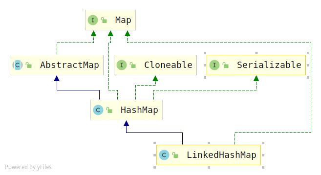

# LinkedHashMap（jdk1.8）源码分析

## 概述

> 1. `LinkedHashMap`在`HashMap`的基础上，通过维护一条双向链表，解决了HashMap不能保持访问顺序和插入顺序一致的问题。

## 类图



## 属性变量

```java
public class LinkedHashMap<K,V>
    extends HashMap<K,V>
    implements Map<K,V>
{

    /**
     * HashMap.Node的子类，用于LinkedHashMap的键值对
     * HashMap.Node subclass for normal LinkedHashMap entries.
     */
    static class Entry<K,V> extends HashMap.Node<K,V> {
        Entry<K,V> before, after; //多了指向前后节点的指针
        Entry(int hash, K key, V value, Node<K,V> next) {
            super(hash, key, value, next);
        }
    }

    private static final long serialVersionUID = 3801124242820219131L;

    /**
     * 头指针，指向双向链表的表头
     */
    transient LinkedHashMap.Entry<K,V> head;

    /**
     * 尾指针，指向双向链表的表尾
     */
    transient LinkedHashMap.Entry<K,V> tail;

    /**
     * The iteration ordering method for this linked hash map: <tt>true</tt>
     * for access-order, <tt>false</tt> for insertion-order.
     */
    final boolean accessOrder;
```

## 构造方法

构造方法基本上是复用HashMap中的构造函数。

```java
/**
 ** accessOrder     the ordering mode - <tt>true</tt> for
 * access-order, <tt>false</tt> for insertion-order
 */
public LinkedHashMap(int initialCapacity) {
    super(initialCapacity);
    accessOrder = false;
}

/**
  * with the default initial capacity (16) and load factor (0.75).
  */
public LinkedHashMap() {
    super();
    accessOrder = false;
}

public LinkedHashMap(Map<? extends K, ? extends V> m) {
    super();
    accessOrder = false;
    putMapEntries(m, false);
}

public LinkedHashMap(int initialCapacity,
                     float loadFactor,
                     boolean accessOrder) {
    super(initialCapacity, loadFactor);
    this.accessOrder = accessOrder;
}
```

## 链表建立过程（插入节点过程中进行）

> LinkedHashMap的键值对的插入其实是复用的HashMap的put方法（因为继承的HashMap），不过它重写了`newNode`和`newTreeNode`方法，很巧妙啊！

```java
public V put(K key, V value) {
    return putVal(hash(key), key, value, false, true);
}

final V putVal(int hash, K key, V value, boolean onlyIfAbsent,
               boolean evict) {
    Node<K,V>[] tab; Node<K,V> p; int n, i;
    if ((tab = table) == null || (n = tab.length) == 0)
        n = (tab = resize()).length;
    if ((p = tab[i = (n - 1) & hash]) == null)
        tab[i] = newNode(hash, key, value, null);
    else {
        Node<K,V> e; K k;
        if (p.hash == hash &&
            ((k = p.key) == key || (key != null && key.equals(k))))
            e = p;
        else if (p instanceof TreeNode)
            e = ((TreeNode<K,V>)p).putTreeVal(this, tab, hash, key, value);
        else {
            for (int binCount = 0; ; ++binCount) {
                if ((e = p.next) == null) {
                    p.next = newNode(hash, key, value, null);
                    if (binCount >= TREEIFY_THRESHOLD - 1) // -1 for 1st
                        treeifyBin(tab, hash);
                    break;
                }
                if (e.hash == hash &&
                    ((k = e.key) == key || (key != null && key.equals(k))))
                    break;
                p = e;
            }
        }
        if (e != null) { // existing mapping for key
            V oldValue = e.value;
            if (!onlyIfAbsent || oldValue == null)
                e.value = value;
            afterNodeAccess(e);
            return oldValue;
        }
    }
    ++modCount;
    if (++size > threshold)
        resize();
    afterNodeInsertion(evict);
    return null;
}
```

我们看一下`newNode`方法

```java
//HashMap.java 这个是HashMap中的
Node<K,V> newNode(int hash, K key, V value, Node<K,V> next) {
    return new Node<>(hash, key, value, next);
}

//LinkedHashMap.java 这个是LinkedHashMap中的
Node<K,V> newNode(int hash, K key, V value, Node<K,V> e) {
    LinkedHashMap.Entry<K,V> p =
        new LinkedHashMap.Entry<K,V>(hash, key, value, e);
    linkNodeLast(p);
    return p;
}

//HashMap.java
TreeNode<K,V> newTreeNode(int hash, K key, V value, Node<K,V> next) {
    return new TreeNode<>(hash, key, value, next);
}

//LinkedHashMap.java
TreeNode<K,V> newTreeNode(int hash, K key, V value, Node<K,V> next) {
    TreeNode<K,V> p = new TreeNode<K,V>(hash, key, value, next);
    linkNodeLast(p);
    return p;
}
```

> 可以看到，其实多个一个`linkNodeLast`方法

进入到`linkNodeList`方法

```java
//链接到双向链表尾部
private void linkNodeLast(LinkedHashMap.Entry<K,V> p) {
    //暂存尾指针
    LinkedHashMap.Entry<K,V> last = tail;
    //尾指针指向当前节点
    tail = p;
    //如果双向链表还是空的
    if (last == null)
        head = p; //头指针也指向当前节点
    else { //否则，将当前节点添加到双向链表的尾部
        p.before = last;
        last.after = p;
    }
}
```

整个过程其实比较简单，并不需要关心他是普通的节点还是树节点

## 链表节点删除过程

> 链表的删除也是复用的HashMap中的`remove`方法，但是，删除节点后，双向链表是怎么维护的呢？在`removeNode`方法的末尾有一个回调方法`afterNodeRemoval`，它在LinkedHashMap中进行了重写，节点删除后，双向链表的维护就在这个回调方法中。

```java
public V remove(Object key) {
    Node<K,V> e;
    return (e = removeNode(hash(key), key, null, false, true)) == null ?
        null : e.value;
}

final Node<K,V> removeNode(int hash, Object key, Object value,
                           boolean matchValue, boolean movable) {
    Node<K,V>[] tab; Node<K,V> p; int n, index;
    if ((tab = table) != null && (n = tab.length) > 0 &&
        (p = tab[index = (n - 1) & hash]) != null) {
        Node<K,V> node = null, e; K k; V v;
        if (p.hash == hash &&
            ((k = p.key) == key || (key != null && key.equals(k))))
            node = p;
        else if ((e = p.next) != null) {
            if (p instanceof TreeNode)
                node = ((TreeNode<K,V>)p).getTreeNode(hash, key);
            else {
                do {
                    if (e.hash == hash &&
                        ((k = e.key) == key ||
                         (key != null && key.equals(k)))) {
                        node = e;
                        break;
                    }
                    p = e;
                } while ((e = e.next) != null);
            }
        }
        if (node != null && (!matchValue || (v = node.value) == value ||
                             (value != null && value.equals(v)))) {
            if (node instanceof TreeNode)
                ((TreeNode<K,V>)node).removeTreeNode(this, tab, movable);
            else if (node == p)
                tab[index] = node.next;
            else
                p.next = node.next;
            ++modCount;
            --size;
            afterNodeRemoval(node);
            return node;
        }
    }
    return null;
}
```

进入`afterNodeRemoval`方法，比较简单，就是在双向链表中删除一个节点。

```java
void afterNodeRemoval(Node<K,V> e) { // unlink
    LinkedHashMap.Entry<K,V> p =
        (LinkedHashMap.Entry<K,V>)e, b = p.before, a = p.after;
    p.before = p.after = null; //垃圾回收
    if (b == null) 
        head = a;
    else
        b.after = a;
    if (a == null)
        tail = b;
    else
        a.before = b;
}
```

## 访问顺序的维护过程

> 默认是按插入顺序维护双向链表，当然，也可以传入参数`accessOrder=true`按访问顺序维护双向链表，即将访问过后的节点添加到链表尾部。

```java
//LinkedHashMap.java中重写
public V get(Object key) {
    Node<K,V> e;
    if ((e = getNode(hash(key), key)) == null)
        return null;
    if (accessOrder) //ture访问模式，false插入模式
        afterNodeAccess(e);
    return e.value;
}

//LinkedHashMap.java中重写
void afterNodeAccess(Node<K,V> e) { // 将访问的节点移动到双向链表尾部
    LinkedHashMap.Entry<K,V> last;
    if (accessOrder && (last = tail) != e) { //访问模式，当前节点不是最后的那个节点
        LinkedHashMap.Entry<K,V> p =
            (LinkedHashMap.Entry<K,V>)e, b = p.before, a = p.after; //保存当前节点的前后指针
        p.after = null;
        if (b == null) //当前节点从链表中断开
            head = a;
        else
            b.after = a;
        if (a != null)
            a.before = b;
        else
            last = b;
        if (last == null) //将节点添加到链表尾部
            head = p;
        else {
            p.before = last;
            last.after = p;
        }
        tail = p;
        ++modCount;
    }
}
```

