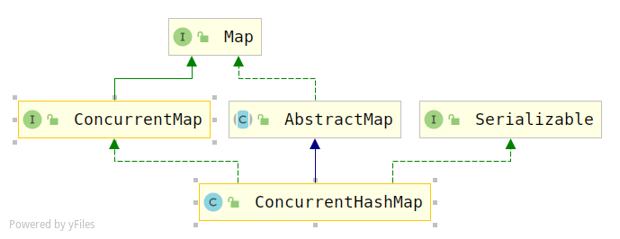

# ConcurrentHashMap（jdk1.7）源码解读

## 概述

## 类图



## 属性变量

```java
public class ConcurrentHashMap<K, V> extends AbstractMap<K, V>
    implements ConcurrentMap<K, V>, Serializable {
    private static final long serialVersionUID = 7249069246763182397L;

    /* ---------------- 常量 -------------- */
    /**
	 * 默认的初始化容量16
     */
    static final int DEFAULT_INITIAL_CAPACITY = 16;

    /**
     * 默认的负载因子0.75
     */
    static final float DEFAULT_LOAD_FACTOR = 0.75f;

    /**
     * 默认的并发度16，也就是默认的segment数组长度
     */
    static final int DEFAULT_CONCURRENCY_LEVEL = 16;

    /**
     * 最大容量2^30
     */
    static final int MAXIMUM_CAPACITY = 1 << 30;

    /**
     * 每个segment table的最小容量，必须是2的n次幂，并且至少有两个，避免
     * 在延迟构造之后，下一次使用时还要立即扩容
     */
    static final int MIN_SEGMENT_TABLE_CAPACITY = 2;

    /**
     * segments数组的最大容量
     */
    static final int MAX_SEGMENTS = 1 << 16; // slightly conservative

    /**
     *非锁定情况下调用size和contains方法的重试次数,避免由于table连续被修改导致无限重试
     */
    static final int RETRIES_BEFORE_LOCK = 2;
    
    /*------------------主要变量--------------*/
     /**
     * 用于索引segments数组的掩码，key的hashcode的高位将会用于选择segment
     */
    final int segmentMask;

    /**
     * 用于计算算segment位置时,hash参与运算的位数
     */
    final int segmentShift;

    /**
     * segments数组，每个元素都相当于一个hashmap
     */
    final Segment<K,V>[] segments;

    transient Set<K> keySet;
    transient Set<Map.Entry<K,V>> entrySet;
    transient Collection<V> values;
```

## Segment数据结构

> `Segment`是`ConcurrentHashMap`的内部类，它继承了`ReentrantLock`

```java
static final class Segment<K,V> extends ReentrantLock implements Serializable {

    private static final long serialVersionUID = 2249069246763182397L;
	
    /* scanAndLockForPut中自旋循环获取锁的最大自旋次数 */
    static final int MAX_SCAN_RETRIES =
        Runtime.getRuntime().availableProcessors() > 1 ? 64 : 1;

    /**
     * hash桶数组，类似HashMap中的table数组
     */
    transient volatile HashEntry<K,V>[] table;

    /**
     * 元素个数
     */
    transient int count;

    /**
     * 结构化修改次数
     */
    transient int modCount;

    /**
     * 负载因子
     */
    final float loadFactor;
```

## HashEntry数据结构

```java
static final class HashEntry<K,V> {
    final int hash;
    final K key;
    volatile V value;
    volatile HashEntry<K,V> next;

    HashEntry(int hash, K key, V value, HashEntry<K,V> next) {
        this.hash = hash;
        this.key = key;
        this.value = value;
        this.next = next;
    }

    /**
     * Sets next field with volatile write semantics.  (See above
     * about use of putOrderedObject.)
     */
    final void setNext(HashEntry<K,V> n) {
        UNSAFE.putOrderedObject(this, nextOffset, n);
    }

    // Unsafe mechanics
    static final sun.misc.Unsafe UNSAFE;
    static final long nextOffset;
    static {
        try {
            UNSAFE = sun.misc.Unsafe.getUnsafe();
            Class k = HashEntry.class;
            nextOffset = UNSAFE.objectFieldOffset
                (k.getDeclaredField("next"));
        } catch (Exception e) {
            throw new Error(e);
        }
    }
}
```

## 构造函数

> 主要讲一下第一个构造函数：
>
> 1. 参数合法性检查，不合法，直接抛出异常。
> 2. 对于入参`concurrencyLevel`，也就是`Segment[]`数组的长度。首先，检查它不能超过规定的`Segment[]`数组的最大长度；其次，要算出大于等于这个值的最小二次幂，因为这个值是最终的`segments[]`数组的长度，它的长度需要满足2的n次幂。在计算的过程中，它会同时保存从1到算出这个2次幂的值的过程中1按位左移的次数`sshift`以及这个2次幂的最终值`ssize`，之后，根据这两个值可以算出`segmentShift和segmentMask`
> 3. 根据初始化容量`initialCapacity`，算出平摊到每个`segment`的元素个数()，其实也就是每个`segment`中对应的`HashEntry[]`数组的长度（默认至少大于等于2），不过`initialCapacity/ssize`算出的值不能直接作为`HashEntry[]`的最终长度，一方面，他不一定能整除，值有损失；另一方面，它的长度也需要满足2的n次幂，所以，要对这两种情况进行处理。
> 4. 创建一个`Segment`对象和`Segment[]`数组对象，并调用`UNSAFE.putOrderedObject`方法将创建的`Segment`对象放到`Segment[]`数组的第一个位置，就是数组下标为0的位置进行初始化。

```java
public ConcurrentHashMap(int initialCapacity,
                         float loadFactor, int concurrencyLevel) {
    if (!(loadFactor > 0) || initialCapacity < 0 || concurrencyLevel <= 0)
        throw new IllegalArgumentException();
    if (concurrencyLevel > MAX_SEGMENTS)
        concurrencyLevel = MAX_SEGMENTS;
    // Find power-of-two sizes best matching arguments
    int sshift = 0;
    int ssize = 1;
    //计算大于等于concurrentcyLevel的最小2的n次幂
    //最后：n=sshift , ssize = 计算出的最小2次幂，它其实是
    while (ssize < concurrencyLevel) {
        ++sshift;
        ssize <<= 1;
    }
    this.segmentShift = 32 - sshift; 
    this.segmentMask = ssize - 1; //掩码
    if (initialCapacity > MAXIMUM_CAPACITY)
        initialCapacity = MAXIMUM_CAPACITY;
    //每个segment中HashEntry数组的大小（平均值）
    int c = initialCapacity / ssize;
    //如果上面不能整除，会舍掉余数，所以，这里要+1，才能满足initialCapacity容量大小
    if (c * ssize < initialCapacity) 
        ++c;
    int cap = MIN_SEGMENT_TABLE_CAPACITY;
    //每个HashEntry数组的大小也要满足2的n次幂
    while (cap < c)
        cap <<= 1;
    // 创建segment[0]元素和segment[]数组
    Segment<K,V> s0 =
        new Segment<K,V>(loadFactor, (int)(cap * loadFactor),
                         (HashEntry<K,V>[])new HashEntry[cap]);
    Segment<K,V>[] ss = (Segment<K,V>[])new Segment[ssize];
    //将s0对象引用存储到对象ss指定内存地址偏移处，这里就是ss[0]处
    UNSAFE.putOrderedObject(ss, SBASE, s0); // ordered write of segments[0]
    this.segments = ss;
}

public ConcurrentHashMap(int initialCapacity, float loadFactor) {
    this(initialCapacity, loadFactor, DEFAULT_CONCURRENCY_LEVEL);
}

public ConcurrentHashMap(int initialCapacity) {
    this(initialCapacity, DEFAULT_LOAD_FACTOR, DEFAULT_CONCURRENCY_LEVEL);
}


public ConcurrentHashMap() {
    this(DEFAULT_INITIAL_CAPACITY, DEFAULT_LOAD_FACTOR, DEFAULT_CONCURRENCY_LEVEL);
}

public ConcurrentHashMap(Map<? extends K, ? extends V> m) {
    this(Math.max((int) (m.size() / DEFAULT_LOAD_FACTOR) + 1,
                  DEFAULT_INITIAL_CAPACITY),
         DEFAULT_LOAD_FACTOR, DEFAULT_CONCURRENCY_LEVEL);
    putAll(m);
}
```

## 添加元素

```java
public V put(K key, V value) {
    Segment<K,V> s;
    //ConcurrentHashMap不能put空值
    if (value == null)
        throw new NullPointerException();
    //计算key的hash值
    int hash = hash(key);
    //计算元素在segment[]的索引
    int j = (hash >>> segmentShift) & segmentMask;
    //判断Segment[j]是否为空，如果是空，则需要创建一个Segment对象,插入到Segment[]数组中
    if ((s = (Segment<K,V>)UNSAFE.getObject          // nonvolatile; recheck
         (segments, (j << SSHIFT) + SBASE)) == null) //  in ensureSegment
        s = ensureSegment(j);
    return s.put(key, hash, value, false);
}
```

看一下`ensureSegment()方法`

> 这个方法可能并发，所以，它在创建Segment对象的时候需要通过`CAS`
>
> 大致过程：
>
> 1. 根据索引k，计算元素在底层`Segment[]`数组中存储的偏移量，然后，获取该位置的`Segment`对象
> 2. 如果获取的`Segment`对象为空，就根据`segments[0]`为原型，创建一个`Segment`对象（主要是要使用原型对象中的属性值）

```java
//返回给定索引的Segment对象，如果没有，则创建一个，并把它记录到Segment[]数组中(通过CAS)
private Segment<K,V> ensureSegment(int k) {
    final Segment<K,V>[] ss = this.segments;
    long u = (k << SSHIFT) + SBASE; // raw offset ss[k]在内存中相对数组起始位置的偏移量
    Segment<K,V> seg;
    //验证ss[k]为空，因为，其他线程可能在同一位置进入插入操作
    if ((seg = (Segment<K,V>)UNSAFE.getObjectVolatile(ss, u)) == null) {
        //使用segment 0 作为原型，因为要使用里面的参数
        Segment<K,V> proto = ss[0]; // use segment 0 as prototype
        int cap = proto.table.length;
        float lf = proto.loadFactor;
        int threshold = (int)(cap * lf);
        //创建HashEntry对象
        HashEntry<K,V>[] tab = (HashEntry<K,V>[])new HashEntry[cap];
        //再次判断Segment[k]是否为空
        if ((seg = (Segment<K,V>)UNSAFE.getObjectVolatile(ss, u))
            == null) { // recheck
            //创建Segment对象
            Segment<K,V> s = new Segment<K,V>(lf, threshold, tab);
            //循环，对Segment[k]进行非空判断，直到没有线程占用时插入
            while ((seg = (Segment<K,V>)UNSAFE.getObjectVolatile(ss, u))
                   == null) {
                //使用CAS
                if (UNSAFE.compareAndSwapObject(ss, u, null, seg = s))
                    break;
            }
        }
    }
    return seg;
}
```

然后，看一下`Segment.put()`方法

```java
//这个方法是在Segment内部类里面
final V put(K key, int hash, V value, boolean onlyIfAbsent) {
    //尝试获取锁，没有获取到，则通过自旋获取
    HashEntry<K,V> node = tryLock() ? null :
    scanAndLockForPut(key, hash, value);
    V oldValue;
    try {
        HashEntry<K,V>[] tab = table;
        //先计算key在HashEntry[]数组中的索引位置
        int index = (tab.length - 1) & hash;
        //获取table[index]里面第一个元素
        HashEntry<K,V> first = entryAt(tab, index);
        //遍历链表
        for (HashEntry<K,V> e = first;;) {
            if (e != null) { //如果当前元素不为空
                K k;
                if ((k = e.key) == key ||
                    (e.hash == hash && key.equals(k))) {//key已经存在
                    oldValue = e.value;
                    if (!onlyIfAbsent) {
                        e.value = value;
                        ++modCount;
                    }
                    break; //跳出循环
                }
                e = e.next; //否则，继续遍历下一个元素
            }
            else {//反之，当前指针指向的元素为空
                if (node != null) //在scanAndLockForPut中已经创建了一个node，直接修改next指针
                    node.setNext(first);
                else //否则，新建一个HashEntry，添加到链表头部（头插法）
                    node = new HashEntry<K,V>(hash, key, value, first);
                int c = count + 1; //元素个数+1
                if (c > threshold && tab.length < MAXIMUM_CAPACITY) //
                    rehash(node); //元素个数超过阈值，扩容
                else
                    setEntryAt(tab, index, node); //将节点添加到HashEntry数组中index的位置
                ++modCount;
                count = c;
                oldValue = null;
                break;
            }
        }
    } finally {
        unlock(); //解锁
    }
    return oldValue;
}
```

> 虽然，`HashEntry`中的`value`使用`volatile`修饰的，但是它并不能保证并发时的原子性，所以put操作时仍然需要加锁处理。
>
> 也就是在put的第一步，要先获取锁，如果获取失败，那肯定有其他线程竞争，则利用`scanAndLockForPut`方法自旋获取锁。

看一下这个方法

```java
private HashEntry<K,V> scanAndLockForPut(K key, int hash, V value) {
    //根据hash值获取HashEntry[]数组中对应桶的元素（也是链表的第一个元素）
    HashEntry<K,V> first = entryForHash(this, hash);
    HashEntry<K,V> e = first;
    HashEntry<K,V> node = null;
    int retries = -1; // negative while locating node
    while (!tryLock()) { //循环尝试获取锁
        HashEntry<K,V> f; // to recheck first below
        if (retries < 0) { //第一次尝试（也可能是重置之后的第一次）
            if (e == null) { 
                // 此时如果node为空，则新建一个HasnEntry对象
                //如果是重置之后第一次，则这个node是不为空的
                if (node == null) 
                    node = new HashEntry<K,V>(hash, key, value, null);
                retries = 0;
            } 
            else if (key.equals(e.key))//节点不为空，并且key和传入的key相等
                retries = 0;
            else //没找到，继续下一个
                e = e.next;
        }
        else if (++retries > MAX_SCAN_RETRIES) { //尝试次数达到了限制的最大值
            lock(); //阻塞获取锁，保证能成功
            break;
        }
        //交替进行头部检查，头结点发生变化，重新从头开始遍历
        else if ((retries & 1) == 0 &&
                 (f = entryForHash(this, hash)) != first) {
            e = first = f; // re-traverse if entry changed
            retries = -1;
        }
    }
    return node;
}
```

> 它其实就是循环获取锁，如果尝试获取锁的次数`retries(初始时是-1)>MAX_SCAN_RETRIES(单核1多核64)`，那么就`阻塞等待锁`。
>
> 在循环的过程中要注意两点：
>
> 1. 如果是第一次尝试获取锁（retries=-1，包括重置后)，并且，第一个节点为空，它会顺便初始化一个新的HashEntry节点，在后面put中使用
> 2. 它会交替进行头结点的检查，如果头结点发生变化（其他线程修改的原因），则从头开始再遍历。

## 扩容rehash

> 这个不需要考虑并发，因为它是在put中调用的，put的第一句就是获取独占锁，所以，调用rehash扩容的时候，已经加锁了。

```java
/**
* 扩容为table的2倍，并且转移键值对，再把node添加到新的table中
* given node to new table
*/
private void rehash(HashEntry<K,V> node) {
    HashEntry<K,V>[] oldTable = table;
    int oldCapacity = oldTable.length;
    int newCapacity = oldCapacity << 1;
    threshold = (int)(newCapacity * loadFactor);
    HashEntry<K,V>[] newTable =
        (HashEntry<K,V>[]) new HashEntry[newCapacity];
    int sizeMask = newCapacity - 1;
    //遍历链表，转移元素，元素在新数组中的位置，旧数组index 或者 旧数据index + oldCap
    for (int i = 0; i < oldCapacity ; i++) {
        HashEntry<K,V> e = oldTable[i]; //链表第一个节点
        if (e != null) { //链表第一个节点不为空
            HashEntry<K,V> next = e.next; //暂存下一个节点指针
            int idx = e.hash & sizeMask; //求当前元素在新数组中的索引下标
            if (next == null)   // 链表只有一个节点，即单节点
                newTable[idx] = e; //直接将它放到新数组索引下标的位置
            else { //否则，链表中有多个节点
                HashEntry<K,V> lastRun = e;//第一个节点是上一个遍历的节点
                int lastIdx = idx;
                //这个循环是小优化，lastIdx后所有的节点在新数组的索引是一样的，可以一次处理
                for (HashEntry<K,V> last = next;
                     last != null;
                     last = last.next) { //遍历后面的
                    int k = last.hash & sizeMask; //计算索引
                    if (k != lastIdx) {
                        lastIdx = k;
                        lastRun = last;
                    }
                }
                //插入链表头部
                newTable[lastIdx] = lastRun;
                //克隆剩余节点
                for (HashEntry<K,V> p = e; p != lastRun; p = p.next) {
                    V v = p.value;
                    int h = p.hash;
                    int k = h & sizeMask; //计算索引
                    HashEntry<K,V> n = newTable[k]; //暂存索引k中放置的旧链表
                    newTable[k] = new HashEntry<K,V>(h, p.key, v, n); //头插法
                }
            }
        }
    }
    int nodeIndex = node.hash & sizeMask; // 添加新节点
    node.setNext(newTable[nodeIndex]);
    newTable[nodeIndex] = node;
    table = newTable;
}
```

## 获取元素

> 获取元素相对于添加元素简单多了

```java
public V get(Object key) {
    Segment<K,V> s; // manually integrate access methods to reduce overhead
    HashEntry<K,V>[] tab;
    int h = hash(key); 
    //计算key在内存中相对数组起始位置的偏移量
    long u = (((h >>> segmentShift) & segmentMask) << SSHIFT) + SBASE;
    //通过UNSAFE调用，获取对应位置的segment对象，并且segment中的HashEntry[]数组不能为空
    if ((s = (Segment<K,V>)UNSAFE.getObjectVolatile(segments, u)) != null &&
        (tab = s.table) != null) {
        //遍历HashEntry[]数组中对应索引位置的链表
        for (HashEntry<K,V> e = (HashEntry<K,V>) UNSAFE.getObjectVolatile
             (tab, ((long)(((tab.length - 1) & h)) << TSHIFT) + TBASE);
             e != null; e = e.next) {
            K k;
            //如果存在key，直接返回对应的值
            if ((k = e.key) == key || (e.hash == h && key.equals(k)))
                return e.value;
        }
    }
    return null;
}
```

## 删除元素

```java
public V remove(Object key) {
    int hash = hash(key);
    Segment<K,V> s = segmentForHash(hash);
    return s == null ? null : s.remove(key, hash, null);
}
```

看一下`Segment.remove()`函数

```java
final V remove(Object key, int hash, Object value) {
    if (!tryLock())
        scanAndLock(key, hash); //获取独占锁
    V oldValue = null;
    try {
        HashEntry<K,V>[] tab = table;
        int index = (tab.length - 1) & hash;
        HashEntry<K,V> e = entryAt(tab, index);
        HashEntry<K,V> pred = null;
        while (e != null) { //遍历链表
            K k;
            HashEntry<K,V> next = e.next;
            if ((k = e.key) == key ||
                (e.hash == hash && key.equals(k))) { //已经存在key相等的元素
                V v = e.value;
                if (value == null || value == v || value.equals(v)) { //值相等
                    if (pred == null) //第一个节点
                        setEntryAt(tab, index, next);
                    else //不是第一个节点
                        pred.setNext(next);
                    ++modCount;
                    --count;
                    oldValue = v;
                }
                break;
            }
            pred = e; //指针向后移动
            e = next;
        }
    } finally {
        unlock(); //释放锁
    }
    return oldValue;
}
```

## size()

> 这个方法还是很有意思的。统计键值对要不要加锁？不加锁可能产生并发，加锁影响读写效率。`ConcurrentHashMap`采用了折中的方法，它会无锁遍历3次，将每个`segment`的`modCount`加到`sum`中，如果前一次遍历的`sum`和这一次遍历的`sum`没有变化，那就说明没有线程修改，直接返回计算出的`每个segment的count和，即size的值`，否则达到了3次，就加锁同步。

```java
/**
 * 返回map中键值对的个数  If the
 * map contains more than <tt>Integer.MAX_VALUE</tt> elements, returns
 * <tt>Integer.MAX_VALUE</tt>.
 */
public int size() {
    // Try a few times to get accurate count. On failure due to
    // continuous async changes in table, resort to locking.
    final Segment<K,V>[] segments = this.segments;
    int size;
    boolean overflow; // true if size overflows 32 bits
    long sum;         // sum of modCounts
    long last = 0L;   // previous sum
    int retries = -1; // first iteration isn't retry
    try {
        for (;;) {
            if (retries++ == RETRIES_BEFORE_LOCK) { //RETRIES_BEFORE_BOCK=2
                for (int j = 0; j < segments.length; ++j)
                    ensureSegment(j).lock(); // force creation
            }
            sum = 0L;
            size = 0;
            overflow = false;
            for (int j = 0; j < segments.length; ++j) {
                Segment<K,V> seg = segmentAt(segments, j);
                if (seg != null) {
                    sum += seg.modCount;
                    int c = seg.count;
                    if (c < 0 || (size += c) < 0)
                        overflow = true;
                }
            }
            if (sum == last)
                break;
            last = sum;
        }
    } finally {
        if (retries > RETRIES_BEFORE_LOCK) { //解锁
            for (int j = 0; j < segments.length; ++j)
                segmentAt(segments, j).unlock();
        }
    }
    return overflow ? Integer.MAX_VALUE : size;
}
```


## 参考

1. [Java魔法类：Unsafe应用解析](https://tech.meituan.com/2019/02/14/talk-about-java-magic-class-unsafe.html)