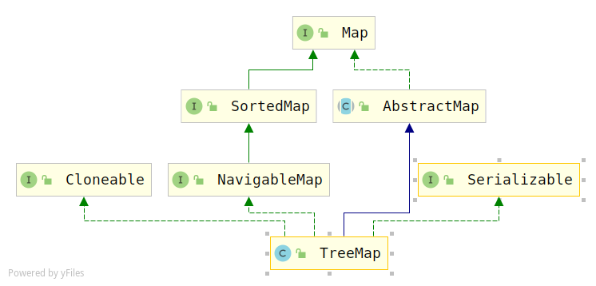

## TreeMap（jdk1.8)源码解析

## 概述

> 1. TreeMap底层是基于红黑树实现，可以在`log(n)`的时间复杂度内进行增删改查、contains操作，效率很高。另一方面，由于红黑树是一棵自平衡的二叉查找树，所以，这为TreeMap中键的有序性打下了基础。

## 类图



> 除了实现`Cloneable和Serializable`接口，继承了`AbstractMap`抽象类。还实现了一个额外的`NavigableMap`接口，这个接口提供了一些具有导航功能的函数，比如：获取仅小于当前键的元素，获取仅大于当前键的元素。

## 属性变量

```java
public class TreeMap<K,V>
    extends AbstractMap<K,V>
    implements NavigableMap<K,V>, Cloneable, java.io.Serializable
{
    /**
     * 这个comparantor对象主要是用于维护tree map中元素的顺序，如果它为null
     * 的话，那就使用自然顺序排序
     */
    private final Comparator<? super K> comparator;
	
	//红黑树根节点
    private transient Entry<K,V> root;

    /**
     * 树中的键值对的个数
     */
    private transient int size = 0;

    /**
     * treeMap结构化修改的次数
     */
    private transient int modCount = 0;
```

## 构造函数

```java
public TreeMap() {
    comparator = null;
}

/**
 * 使用指定的比较器
 */
public TreeMap(Comparator<? super K> comparator) {
    this.comparator = comparator;
}

/**
 * 使用指定的集合初始化map
 */
public TreeMap(Map<? extends K, ? extends V> m) {
    comparator = null;
    putAll(m);
}

/**
 * 根据指定的sortedMap初始化treemap
 */
public TreeMap(SortedMap<K, ? extends V> m) {
    comparator = m.comparator();
    try {
        buildFromSorted(m.size(), m.entrySet().iterator(), null, null);
    } catch (java.io.IOException cannotHappen) {
    } catch (ClassNotFoundException cannotHappen) {
    }
}
```

## 添加数据

> 其实就是往红黑树中添加一个节点。添加节点后，可能破坏红黑树的结构，因此，最后有一个调整函数`fixAfterInsertion（）`

```java
public V put(K key, V value) {
    Entry<K,V> t = root;
    if (t == null) {
        compare(key, key); // 类型检查
		//创建新的节点，初始化treeMap中的属性变量
        root = new Entry<>(key, value, null);
        size = 1;
        modCount++;
        return null;
    }
    int cmp;
    Entry<K,V> parent;
    // split comparator and comparable paths
    Comparator<? super K> cpr = comparator;
    if (cpr != null) { //比较器不为空
        do {//循环，使用默认的比较器查找有没有节点
            parent = t;
            cmp = cpr.compare(key, t.key);
            if (cmp < 0)
                t = t.left;
            else if (cmp > 0)
                t = t.right;
            else
                return t.setValue(value);
        } while (t != null);
    }
    else { //没有默认比较器
        if (key == null) 
            throw new NullPointerException();
        @SuppressWarnings("unchecked")
        Comparable<? super K> k = (Comparable<? super K>) key;
        do {
            parent = t;
            cmp = k.compareTo(t.key);
            if (cmp < 0)
                t = t.left;
            else if (cmp > 0)
                t = t.right;
            else
                return t.setValue(value);
        } while (t != null);
    }
    //新建节点
    Entry<K,V> e = new Entry<>(key, value, parent);
    if (cmp < 0) //新节点是左孩子
        parent.left = e;
    else //新节点是右孩子
        parent.right = e;
    //插入节点可能破坏红黑树的结构，所以要进行调整
    fixAfterInsertion(e);
    size++;
    modCount++;
    return null;
}
```

## 获取数据

```java
public V get(Object key) {
    Entry<K,V> p = getEntry(key);
    return (p==null ? null : p.value);
}

final Entry<K,V> getEntry(Object key) {
    // 比较器不为空，使用指定的比较器
    if (comparator != null)
        return getEntryUsingComparator(key);
    if (key == null)
        throw new NullPointerException();
    @SuppressWarnings("unchecked")
    //比较器为空，使用key内置的比较方法compareTo（前提是key要实现Comparable接口）
    Comparable<? super K> k = (Comparable<? super K>) key;
    Entry<K,V> p = root;
    while (p != null) { //二分查找
        int cmp = k.compareTo(p.key);
        if (cmp < 0)
            p = p.left;
        else if (cmp > 0)
            p = p.right;
        else
            return p;
    }
    return null;
}
```

## 删除数据

```java
public V remove(Object key) {
    Entry<K,V> p = getEntry(key);
    if (p == null)
        return null;

    V oldValue = p.value;
    deleteEntry(p);
    return oldValue;
}

//删除节点，并且使树重新达到平衡
private void deleteEntry(Entry<K,V> p) {
    modCount++;
    size--;

    // If strictly internal, copy successor's element to p and then make p
    // point to successor.
    if (p.left != null && p.right != null) {
        Entry<K,V> s = successor(p);
        p.key = s.key;
        p.value = s.value;
        p = s;
    } // p has 2 children

    // Start fixup at replacement node, if it exists.
    Entry<K,V> replacement = (p.left != null ? p.left : p.right);

    if (replacement != null) {
        // Link replacement to parent
        replacement.parent = p.parent;
        if (p.parent == null)
            root = replacement;
        else if (p == p.parent.left)
            p.parent.left  = replacement;
        else
            p.parent.right = replacement;

        // Null out links so they are OK to use by fixAfterDeletion.
        p.left = p.right = p.parent = null;

        // Fix replacement
        if (p.color == BLACK)
            fixAfterDeletion(replacement);
    } else if (p.parent == null) { // return if we are the only node.
        root = null;
    } else { //  No children. Use self as phantom replacement and unlink.
        if (p.color == BLACK)
            fixAfterDeletion(p);

        if (p.parent != null) {
            if (p == p.parent.left)
                p.parent.left = null;
            else if (p == p.parent.right)
                p.parent.right = null;
            p.parent = null;
        }
    }
}
```

