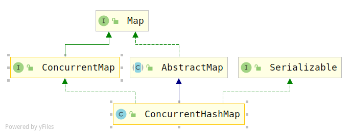

# ConcurrentHashMap(jdk1.8)源码分析

## 概述

## 类图



> 这个和1.7的类图结构是一样的。

## 属性变量

```java
public class ConcurrentHashMap<K,V> extends AbstractMap<K,V>
    implements ConcurrentMap<K,V>, Serializable {
    private static final long serialVersionUID = 7249069246763182397L;
/* ---------------- Constants -------------- */

    /**
     * table的最大容量2^30
     */
    private static final int MAXIMUM_CAPACITY = 1 << 30;

    /**
     * 默认的初始化容量16
     */
    private static final int DEFAULT_CAPACITY = 16;

    /**
     * 数组最大容量
     */
    static final int MAX_ARRAY_SIZE = Integer.MAX_VALUE - 8;

    /**
     * 默认的并发度，没用，这里主要是和之前版本兼容
     */
    private static final int DEFAULT_CONCURRENCY_LEVEL = 16;

    /**
     * 负载因子
     */
    private static final float LOAD_FACTOR = 0.75f;

    /**
     * 树化的阈值，至少为8个
     */
    static final int TREEIFY_THRESHOLD = 8;

    /**
     * 把红黑树转换为链表的阈值，节点低于6个，并且，最多6个
     */
    static final int UNTREEIFY_THRESHOLD = 6;

    /**
     * 节点树化时，table的容量至少少为64，否则，table会进行扩容
     * 它的值至少是4 * TREEIFY_THRESHOLD 避免扩容和树化时的冲突
     */
    static final int MIN_TREEIFY_CAPACITY = 64;

    /**
     * Minimum number of rebinnings per transfer step. Ranges are
     * subdivided to allow multiple resizer threads.  This value
     * serves as a lower bound to avoid resizers encountering
     * excessive memory contention.  The value should be at least
     * DEFAULT_CAPACITY.
     */
    private static final int MIN_TRANSFER_STRIDE = 16;

    /**
     * The number of bits used for generation stamp in sizeCtl.
     * Must be at least 6 for 32bit arrays.
     */
    private static int RESIZE_STAMP_BITS = 16;

    /**
     * The maximum number of threads that can help resize.
     * Must fit in 32 - RESIZE_STAMP_BITS bits.
     */
    private static final int MAX_RESIZERS = (1 << (32 - RESIZE_STAMP_BITS)) - 1;

    /**
     * The bit shift for recording size stamp in sizeCtl.
     */
    private static final int RESIZE_STAMP_SHIFT = 32 - RESIZE_STAMP_BITS;

    /*
     * Encodings for Node hash fields. See above for explanation.
     */
    static final int MOVED     = -1; // hash for forwarding nodes
    static final int TREEBIN   = -2; // hash for roots of trees
    static final int RESERVED  = -3; // hash for transient reservations
    static final int HASH_BITS = 0x7fffffff; // usable bits of normal node hash

    /** Number of CPUS, to place bounds on some sizings */
    static final int NCPU = Runtime.getRuntime().availableProcessors();
    
    /** -----------------------主要的变量 -------------------------------------*/
    /**
     * 存储节点的数组，它会在第一次插入数据的时候初始化
     * 大小是2的n次幂
     */
    transient volatile Node<K,V>[] table;

    /**
     * 下一个要使用的table，扩容时不能为空
     */
    private transient volatile Node<K,V>[] nextTable;

    /**
     * 基础计数，主要在没有内存争夺时使用，在table初始化时也作为一个回调，
     * 通过CAS更新
     */
    private transient volatile long baseCount;

    /**
     * 用于table初始化和扩容的控制。当它是负数的时候，table会被初始化或者扩容
     * -1用于初始化，-(1+活跃的扩容线程数)用于扩容。
     * 除此之外，当table为空的时候，它会保存inital table的大小，在创建table的时候使用
     * 初始化之后，它里面放的是元素个数的计数
     */
    private transient volatile int sizeCtl;

    /**
     * The next table index (plus one) to split while resizing.
     */
    private transient volatile int transferIndex;

    /**
     * Spinlock (locked via CAS) used when resizing and/or creating CounterCells.
     */
    private transient volatile int cellsBusy;

    /**
     * Table of counter cells. When non-null, size is a power of 2.
     */
    private transient volatile CounterCell[] counterCells;

    // views
    private transient KeySetView<K,V> keySet;
    private transient ValuesView<K,V> values;
    private transient EntrySetView<K,V> entrySet;
```

##  重要的类

### Node <k, v>

```java
//一个node就是一个键值对
static class Node<K,V> implements Map.Entry<K,V> {
    final int hash;
    final K key;
    volatile V val;
    volatile Node<K,V> next;

    Node(int hash, K key, V val, Node<K,V> next) {
        this.hash = hash;
        this.key = key;
        this.val = val;
        this.next = next;
    }

    public final K getKey()       { return key; }
    public final V getValue()     { return val; }
    public final int hashCode()   { return key.hashCode() ^ val.hashCode(); }
    public final String toString(){ return key + "=" + val; }
    public final V setValue(V value) {
        throw new UnsupportedOperationException();
    }
```

> 1. `Node<K,V>`实现类`Map.Entry<K, V>`接口，里面存放的是一个键值对。

## 构造方法

```java
public ConcurrentHashMap() {
}

public ConcurrentHashMap(int initialCapacity) {
    if (initialCapacity < 0)
        throw new IllegalArgumentException();
    int cap = ((initialCapacity >= (MAXIMUM_CAPACITY >>> 1)) ?
               MAXIMUM_CAPACITY :
               tableSizeFor(initialCapacity + (initialCapacity >>> 1) + 1));
    this.sizeCtl = cap;
}

public ConcurrentHashMap(Map<? extends K, ? extends V> m) {
    this.sizeCtl = DEFAULT_CAPACITY;
    putAll(m);
}

public ConcurrentHashMap(int initialCapacity, float loadFactor) {
    this(initialCapacity, loadFactor, 1);
}

//主要是这个
public ConcurrentHashMap(int initialCapacity,
                         float loadFactor, int concurrencyLevel) {
    //参数合法性校验
    if (!(loadFactor > 0.0f) || initialCapacity < 0 || concurrencyLevel <= 0)
        throw new IllegalArgumentException();
    //初始化容量比并发度小，则将initialCapacity的值修改成并发度的值
    if (initialCapacity < concurrencyLevel)   // Use at least as many bins
        initialCapacity = concurrencyLevel;   // as estimated threads
    //初步计算一下table的size大小
    long size = (long)(1.0 + (long)initialCapacity / loadFactor);
    //计算容量，要么是默认的最大值，要么就求大于等于size的最小二次幂，作为cap
    int cap = (size >= (long)MAXIMUM_CAPACITY) ?
        MAXIMUM_CAPACITY : tableSizeFor((int)size);
    this.sizeCtl = cap;
}
```

## 添加元素

```java
public V put(K key, V value) {
    return putVal(key, value, false);
}

final V putVal(K key, V value, boolean onlyIfAbsent) {
    //key和value都不允许为空
    if (key == null || value == null) throw new NullPointerException();
    //hashcode高位移动到低位参与运算，增加随机性，减少碰撞
    int hash = spread(key.hashCode());
    int binCount = 0;
    for (Node<K,V>[] tab = table;;) {
        Node<K,V> f; int n, i, fh;
        //如果table为空，在这里进行初始化
        if (tab == null || (n = tab.length) == 0)
            tab = initTable();
        else if ((f = tabAt(tab, i = (n - 1) & hash)) == null) {//桶i的位置为空
            if (casTabAt(tab, i, null,
                         new Node<K,V>(hash, key, value, null)))
                break;                   // no lock when adding to empty bin
        }
        else if ((fh = f.hash) == MOVED) //hash=-1，正在进行数组扩容的复制阶段，当前线程帮忙复制
            tab = helpTransfer(tab, f);
        else {
            V oldVal = null;
            synchronized (f) { //加锁
                if (tabAt(tab, i) == f) {  //再次比较
                    if (fh >= 0) { //元素的hash值大于0
                        binCount = 1;
                        for (Node<K,V> e = f;; ++binCount) { //遍历链表
                            K ek;
                            if (e.hash == hash &&
                                ((ek = e.key) == key ||
                                 (ek != null && key.equals(ek)))) { //元素已经存在
                                oldVal = e.val;
                                if (!onlyIfAbsent)
                                    e.val = value;
                                break;
                            }
                            Node<K,V> pred = e; //pred指针后移
                            //next指针后移，如果next为空，则将元素添加到链表末尾
                            if ((e = e.next) == null) { 
                                pred.next = new Node<K,V>(hash, key,
                                                          value, null);
                                break; //跳出循环
                            }
                        }
                    }
                    else if (f instanceof TreeBin) { //如果节点类型是树
                        Node<K,V> p;
                        binCount = 2;
                        //调用函数，将值put到红黑树中
                        if ((p = ((TreeBin<K,V>)f).putTreeVal(hash, key,
                                                              value)) != null) {
                            oldVal = p.val;
                            if (!onlyIfAbsent)
                                p.val = value;
                        }
                    }
                }
            }
            if (binCount != 0) {
                if (binCount >= TREEIFY_THRESHOLD) //binCount >=8
                    treeifyBin(tab, i); 树化
                if (oldVal != null)
                    return oldVal;
                break;
            }
        }
    }
    addCount(1L, binCount); //计数
    return null;
}
```

table在第一次put的时候进行初始化，看一下`initTable()`函数

```java
/**
 * 使用sizeCtl记录的size值来初始化table
 */
private final Node<K,V>[] initTable() {
    Node<K,V>[] tab; int sc;
    //因为存在并发，所以这里是循环判断table是否为空
    while ((tab = table) == null || tab.length == 0) {
        //如果sizeCtl<0，说明有一个线程执行CAS操作成功，那么当前线程让出时间片
        if ((sc = sizeCtl) < 0)
            Thread.yield(); // lost initialization race; just spin
        //使用UNSAFE类的CAS，判断this对象偏移量为SIZECTL的位置的值和sc是否相等
        //相等则将-1赋值给sc，返回true，反之，不赋值，返回false
        else if (U.compareAndSwapInt(this, SIZECTL, sc, -1)) {
            try {
                if ((tab = table) == null || tab.length == 0) { //再次判断
                    int n = (sc > 0) ? sc : DEFAULT_CAPACITY;
                    @SuppressWarnings("unchecked")
                    Node<K,V>[] nt = (Node<K,V>[])new Node<?,?>[n]; //创建数组
                    table = tab = nt;
                    sc = n - (n >>> 2); //0.75 * capacity
                }
            } finally {
                sizeCtl = sc;
            }
            break;
        }
    }
    return tab;
}
```

## 扩容

> 从上面的put函数我们可以发现
>
> 1. 当桶中节点个数超过8个的时候，会调用`treeifyBin()`方法来看看是扩容还是转化为一棵树。
> 2. 每次添加完元素`addCount()`的时候，会判断当前数组中的元素是否达到了`sizeCtl`的值，如果达到了，则进入`transfer()`方法进行扩容。

```java
private final void treeifyBin(Node<K,V>[] tab, int index) {
    Node<K,V> b; int n, sc;
    if (tab != null) {
        if ((n = tab.length) < MIN_TREEIFY_CAPACITY)
            tryPresize(n << 1); //扩容
        //index处元素不为空，并且hash值>0
        else if ((b = tabAt(tab, index)) != null && b.hash >= 0) { 
            synchronized (b) {
                if (tabAt(tab, index) == b) {//再次判断
                    TreeNode<K,V> hd = null, tl = null;
                    for (Node<K,V> e = b; e != null; e = e.next) { //遍历节点
                        TreeNode<K,V> p =
                            new TreeNode<K,V>(e.hash, e.key, e.val,
                                              null, null); //转成树节点
                        //当前节点前驱为空，则它是树的树根
                        if ((p.prev = tl) == null)
                            hd = p; 
                        else 
                            tl.next = p;
                        tl = p;
                    }
                    setTabAt(tab, index, new TreeBin<K,V>(hd));
                }
            }
        }
    }
}
```

> 这里在进行树化的时候，会判断当前数组的容量是不是<64，如果是，则优先进行扩容；否则，则进行树化。
>
> 扩容函数是`tryPresize()`

## 参考

1. [ConcurrentHashMap源码解析（jdk1.8）](https://blog.csdn.net/programmer_at/article/details/79715177#12-%E5%AE%9E%E4%BE%8B%E5%88%9D%E5%A7%8B%E5%8C%96)
2. [ConcurrentHashMap源码分析(1.8)](https://www.cnblogs.com/zerotomax/p/8687425.html)

