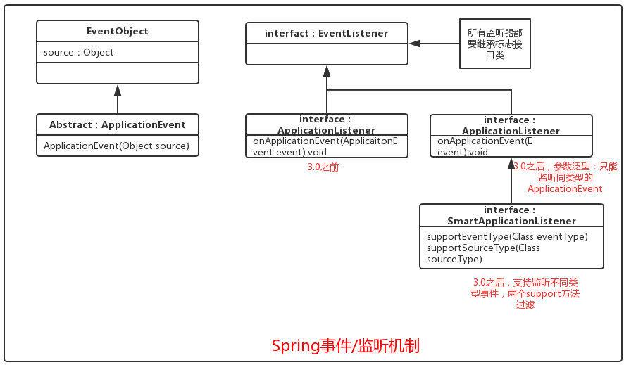
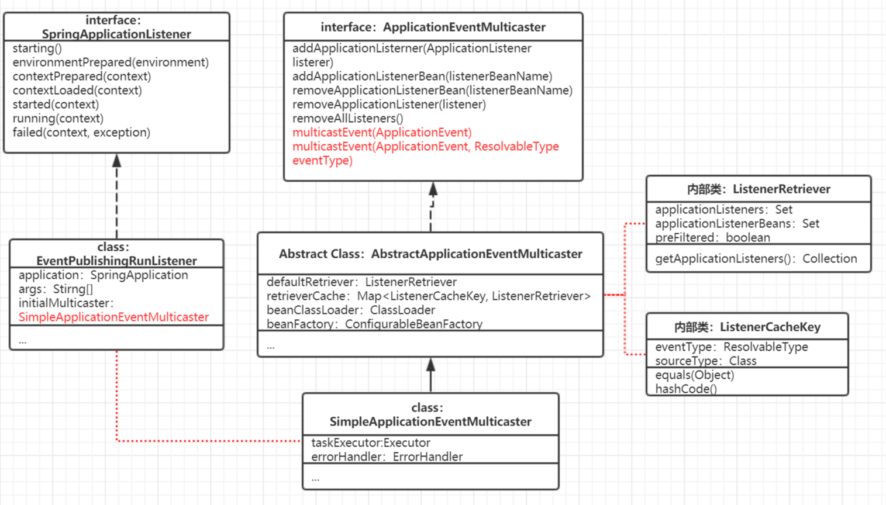

## 理解SpringApplicationRunListeners

按照代码逻辑：

```java
SpringApplicationRunListeners listeners = getRunListeners(args);
```

`SpringApplicationRunListeners`是通过`getRunListeners(String[])`方法获取的。

```java
public class SpringApplication {
    
    private SpringApplicationRunListeners getRunListeners(String[] args) {
		Class<?>[] types = new Class<?>[] { SpringApplication.class, String[].class };
		return new SpringApplicationRunListeners(logger,
				getSpringFactoriesInstances(SpringApplicationRunListener.class, types, this, args));
	}

	private <T> Collection<T> getSpringFactoriesInstances(Class<T> type) {
		return getSpringFactoriesInstances(type, new Class<?>[] {});
	}

	private <T> Collection<T> getSpringFactoriesInstances(Class<T> type, Class<?>[] parameterTypes, Object... args) {
		ClassLoader classLoader = getClassLoader();
		// Use names and ensure unique to protect against duplicates
		Set<String> names = new LinkedHashSet<>(SpringFactoriesLoader.loadFactoryNames(type, classLoader));
		List<T> instances = createSpringFactoriesInstances(type, parameterTypes, classLoader, args, names);
		AnnotationAwareOrderComparator.sort(instances);
		return instances;
	}
}
```

观察`getRunListeners(String[])`方法，我们发现：这个方法利用`getSpringFactoriesInstances(Class, Class, Object...)`工厂机制方法获取到了所有的`SpringApplicationRunListener`实现类的实例。然后，将`SpringApplicationRunListener`实例的集合关联到了`SpringApplicationRunListeners`.

可以看一下`SpringApplicationRunListeners`类的源码：

```java
class SpringApplicationRunListeners {

	private final Log log;

	private final List<SpringApplicationRunListener> listeners;

	SpringApplicationRunListeners(Log log, Collection<? extends SpringApplicationRunListener> listeners) {
		this.log = log;
		this.listeners = new ArrayList<>(listeners);
	}

	void starting() {
		for (SpringApplicationRunListener listener : this.listeners) {
			listener.starting();
		}
	}
    //其他方法
    ...
}
```

那么，`SpringApplicationRunListener`又是什么样的？我们接着往后看。

## 理解SpringApplicationRunListener

`SpringApplicationRunListener`可以理解为SpringBoot应用的运行时监听器，它的监听方法会被`SpringApplicationRunListeners`迭代执行。其监听方法包括：

> - `environmentPrepared(ConfigurableEnvironment)`：`ConfigurableEnvironment`准备妥当，允许将其调整。
> - `contextPrepared(ConfigurableApplicationContext)`：上下文准备妥当，运行对其进行调整
> - `contextLoaded(ConfigurableApplicationContext)`：上下文已经装载，任未启动
> - `starting(ConfigurableApplicationContext)`：spring应用刚启动
> - `started(ConfigurableApplicationContext)`：上下文已经启动，此时，SpringBean已经初始化完成
> - `running(ConfigurableApplicationContext)`：Spring应用正在运行
> - `failed(ConfigurableApplicationContext, Throwableexception)`：Spring应用运行失败

我们看一下`SpringApplicationRunListener`的源码：

```java
public interface SpringApplicationRunListener {

	/**
	 * Called immediately when the run method has first started. Can be used for very
	 * early initialization.
	 */
	default void starting() {
	}

	/**
	 * Called once the environment has been prepared, but before the
	 * {@link ApplicationContext} has been created.
	 * @param environment the environment
	 */
	default void environmentPrepared(ConfigurableEnvironment environment) {
	}

	/**
	 * Called once the {@link ApplicationContext} has been created and prepared, but
	 * before sources have been loaded.
	 * @param context the application context
	 */
	default void contextPrepared(ConfigurableApplicationContext context) {
	}

	/**
	 * Called once the application context has been loaded but before it has been
	 * refreshed.
	 * @param context the application context
	 */
	default void contextLoaded(ConfigurableApplicationContext context) {
	}

	/**
	 * The context has been refreshed and the application has started but
	 * {@link CommandLineRunner CommandLineRunners} and {@link ApplicationRunner
	 * ApplicationRunners} have not been called.
	 * @param context the application context.
	 * @since 2.0.0
	 */
	default void started(ConfigurableApplicationContext context) {
	}

	/**
	 * Called immediately before the run method finishes, when the application context has
	 * been refreshed and all {@link CommandLineRunner CommandLineRunners} and
	 * {@link ApplicationRunner ApplicationRunners} have been called.
	 * @param context the application context.
	 * @since 2.0.0
	 */
	default void running(ConfigurableApplicationContext context) {
	}

	/**
	 * Called when a failure occurs when running the application.
	 * @param context the application context or {@code null} if a failure occurred before
	 * the context was created
	 * @param exception the failure
	 * @since 2.0.0
	 */
	default void failed(ConfigurableApplicationContext context, Throwable exception) {
	}

}

```

`SpringApplicationRunListener`是一个接口，它只有唯一一个内建的实现：`EventPublishingRunListener`

```java
public class EventPublishingRunListener implements SpringApplicationRunListener, Ordered {

	private final SpringApplication application;

	private final String[] args;

	private final SimpleApplicationEventMulticaster initialMulticaster;

	public EventPublishingRunListener(SpringApplication application, String[] args) {
		this.application = application;
		this.args = args;
		this.initialMulticaster = new SimpleApplicationEventMulticaster();
		for (ApplicationListener<?> listener : application.getListeners()) {
			this.initialMulticaster.addApplicationListener(listener);
		}
	}

	@Override
	public int getOrder() {
		return 0;
	}

	@Override
	public void starting() {
		this.initialMulticaster.multicastEvent(new ApplicationStartingEvent(this.application, this.args));
	}
    
    @Override
	public void environmentPrepared(ConfigurableEnvironment environment) {
		this.initialMulticaster
				.multicastEvent(new ApplicationEnvironmentPreparedEvent(this.application, this.args, environment));
	}
    //其他监听方法实现
    ...
}
```

这个类只有一个有参的构造器，而且关联了`applciation`和`args`以及一个`SimpleApplicationEventMulticaster`对象。在构造器中，我们可以发现，这个类从`SpringApplication`实例`application`中获取到了所有的`ApplicationRunListener`实例，然后，将这些`ApplicationRunListener`实例都关联到了`SimpleApplicationEventMulticaster`。

> `SimpleApplicationEventMulticaster`实现了`ApplicationEventMulticaster`接口，用于发布Spring的应用事件（ApplicationEvent），因此，上面的类`EventPublishingRunListener`实际上充当的是SpringBoot事件发布者的角色。例如：它在`Starting()`方法中发布了`ApplicationStartingEvent`事件。

## 理解SpringBoot事件

一般每种监听方法都对应着一个SpringBoot事件

| 监听方法                                          | SpringBoot事件                        | 起始版本 |
| ------------------------------------------------- | ------------------------------------- | -------- |
| `starting()`                                      | `ApplicationStartingEvent`            | 1.5      |
| `environmentPrepared(ConfigurableEnvironment)`    | `ApplicationEnvironmentPreparedEvent` | 1.0      |
| `contextPrepared(ConfigurableApplicationContext)` |                                       | 1.0      |
| `contextLoaded(ConfigurableApplicationContext)`   | `ApplicationPreparedEvent`            | 1.0      |
| `started(ConfigurableApplicationContext)`         | `ApplicationStartedEvent`             | 1.0      |
| `running(ConfigurableApplicationContext)`         | `ApplicationReadyEvent`               | 1.3      |
| `failed(applictioncontext, Throwable)`            | `ApplicationFailedEvent`              | 1.0      |

<font color=red>需要注意：</font>

> `SpringApplicationRunListener`是SpringBoot应用运行时的监听器，不是SpringBoot事件监听器。

SpringBoot对应的`ApplicationListener`（应用监听器）是由`SpringApplication`类的构造函数初始化的。在上面的`SpringApplicationRunListener`（确切的说，是它的实现类：`EventPublishingRunListener`）构造函数中，它从`SpringApplication`获取到所有的`ApplicationListener`，并添加到属性`initiaMulticaster（SimpleApplicationEventMulticaster实例）`中，在`SpringApplicationRunListener#starting()`方法执行时，`ApplicationStartingEvent`随即触发，此时，`initiaMulticaster`会同步执行`ApplicationListener<ApplicationStartingEvent>`集合的监听回调方法`onApplicationEvent(ApplicationStartingEvent)`。

## Spring事件/监听机制



> 说明：
>
> 1. 所有的事件都要继承`EventObject`接口
> 2. 所有的监听器都要继承`EventListener`标志接口
> 3. Spirng监听器限制了监听方法的数量，只抽象了单一方法`onApplicationEvent(ApplicationEvent)`，将其用于监听Spring事件的ApplicationEvent。
> 4. 在`ApplicationListener`中只有一个监听方法`OnApplicationEvent(ApplicationEvent)`，那么，它如何区分不同类型的event呢？
>    - spring3.0之前：无解，要过滤不同类型的事件，需要通过`instalceOf`方式筛选。
>    - spring3.0之后：加入了泛型监听，不再需要`instanceOf`。
>    - 泛型监听虽然方便，但它只能监听同类型的事件，无法监听不同类型的事件，所以，spring3.0之后又引入了`SmartApplicationListener`，它继承了`ApplicationListener(ApplicationEvent)`，同时，又加入了两个support方法进行过滤event类型和事件源类型，从而，实现了可以监听不同类型的事件。

### Spring事件发布



说明：

1. 事件的发布是由`EventPublishingRunListener`执行的，更确切的说，事件是由`EventPublishingRunListener`内部的`SimpleApplicationEventMulticaster`执行的。
2. `SimpleApplicationEventMulticaster`是`ApplicationEventMulticaster`接口的实现类，这个接口主要有两个功能：
   - 关联`ApplicationListener`
   - 广播`ApplicationEvent`

### Spring事件广播

在`ApplicationEventMulticaster`接口中，有两个用于广播event的方法`multicastEvent(ApplicationEvent)`和`multicastEvent(ApplicationEvent, ResolvableType)`，两个方法都在`SimpleApplicationEventMulticaster`中实现。

```java
public class SimpleApplicationEventMulticaster {
    @Override
	public void multicastEvent(ApplicationEvent event) {
		multicastEvent(event, resolveDefaultEventType(event));
	}

	@Override
	public void multicastEvent(final ApplicationEvent event, @Nullable ResolvableType eventType) {
		ResolvableType type = (eventType != null ? eventType : resolveDefaultEventType(event));
		Executor executor = getTaskExecutor();
        //循环比例所有ApplicationListener，
		for (ApplicationListener<?> listener : getApplicationListeners(event, type)) {
			if (executor != null) {
				executor.execute(() -> invokeListener(listener, event));
			}
			else {
				invokeListener(listener, event);
			}
		}
	}
    
    protected void invokeListener(ApplicationListener<?> listener, ApplicationEvent event) {
		ErrorHandler errorHandler = getErrorHandler();
		if (errorHandler != null) {
			try {
				doInvokeListener(listener, event);
			}
			catch (Throwable err) {
				errorHandler.handleError(err);
			}
		}
		else {
			doInvokeListener(listener, event);
		}
	}
    
    private void doInvokeListener(ApplicationListener listener, ApplicationEvent event) {
		try {
			listener.onApplicationEvent(event);
		}
		catch (ClassCastException ex) {
			String msg = ex.getMessage();
			if (msg == null || matchesClassCastMessage(msg, event.getClass())) {
				// Possibly a lambda-defined listener which we could not resolve the generic event type for
				// -> let's suppress the exception and just log a debug message.
				Log logger = LogFactory.getLog(getClass());
				if (logger.isTraceEnabled()) {
					logger.trace("Non-matching event type for listener: " + listener, ex);
				}
			}
			else {
				throw ex;
			}
		}
	}
    
}
```

